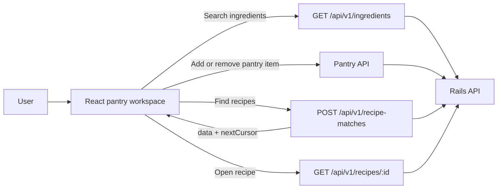
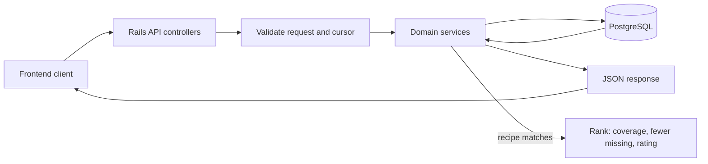

# Problem statement

Recipe Finder helps people decide what to cook from the ingredients they have
at home. They can search the ingredient catalogue, build an anonymous pantry,
and find recipes ordered by ingredient coverage, then by fewer missing
ingredients and rating.

## Application

- [`frontend/`](frontend/README.md) is a React, TypeScript, and Vite
  single-page app. It provides pantry management, explicit recipe search,
  cursor-based infinite result loading, and recipe details that show owned and
  missing ingredients.
- [`backend/`](backend/README.md) is a Rails 8 API backed by PostgreSQL. It
  imports and normalizes the recipe catalogue, exposes the JSON API, maintains
  anonymous pantries, and calculates exact ingredient matches with cursor
  pagination.

The frontend calls the backend API directly.

## Frontend workflow



Recipe matching is explicit: editing the pantry does not replace the displayed
results until the user selects **Find recipes** again. React Query retains the
current results and follows `nextCursor` as the user scrolls.

## Backend workflow



The backend imports the recipe catalogue into normalized recipe and ingredient
records. Pantry endpoints use a device-local anonymous session, while recipe
matches can be calculated directly from submitted ingredient IDs.

## Backend API

The API is served under `/api/v1`. Pantry endpoints require an
`X-Pantry-Session` header containing a client-generated UUID.

| Method | Path | Purpose |
| --- | --- | --- |
| `GET` | `/ingredients?q=&limit=&cursor=` | Search the canonical ingredient catalogue |
| `GET` | `/categories?limit=&cursor=` | List recipe categories |
| `GET` | `/pantry-items?limit=&cursor=` | List the current anonymous pantry |
| `POST` | `/pantry-items` | Add an ingredient with `{ "ingredientId": "..." }` |
| `DELETE` | `/pantry-items/:id` | Remove a pantry item |
| `POST` | `/recipe-matches` | Find ranked recipes from selected ingredient IDs |
| `GET` | `/recipes/:id` | Fetch recipe details with owned and missing ingredients |

Cursor-paginated responses return `{ data, nextCursor }`; send `nextCursor` as
`cursor` to load the next page. The [backend README](backend/README.md) has the
complete request and response contract, and the [frontend README](frontend/README.md)
describes how the UI uses it.

## Run locally

The quickest way to start the full stack is Docker Compose:

```bash
docker compose up --build
```

This starts PostgreSQL, the Rails API at `http://localhost:3000`, and the Vite
frontend at `http://localhost:5173`.

To run the applications directly, start PostgreSQL first and use two terminals:

```bash
# terminal 1 — backend
cd backend
bundle install
bin/rails db:create db:migrate
bin/rails db:seed
bin/rails server
```

```bash
# terminal 2 — frontend
cd frontend
pnpm install
cp .env.example .env
pnpm dev
```

`VITE_API_BASE_URL` defaults to `http://localhost:3000`; set it in
`frontend/.env` when the API is elsewhere.

## Test and check

```bash
# backend — PostgreSQL must be available
cd backend
RAILS_ENV=test bin/rails db:prepare
bundle exec rspec
bundle exec rubocop
bundle exec srb tc
```

```bash
# frontend
cd frontend
pnpm test
pnpm lint
pnpm build
```

