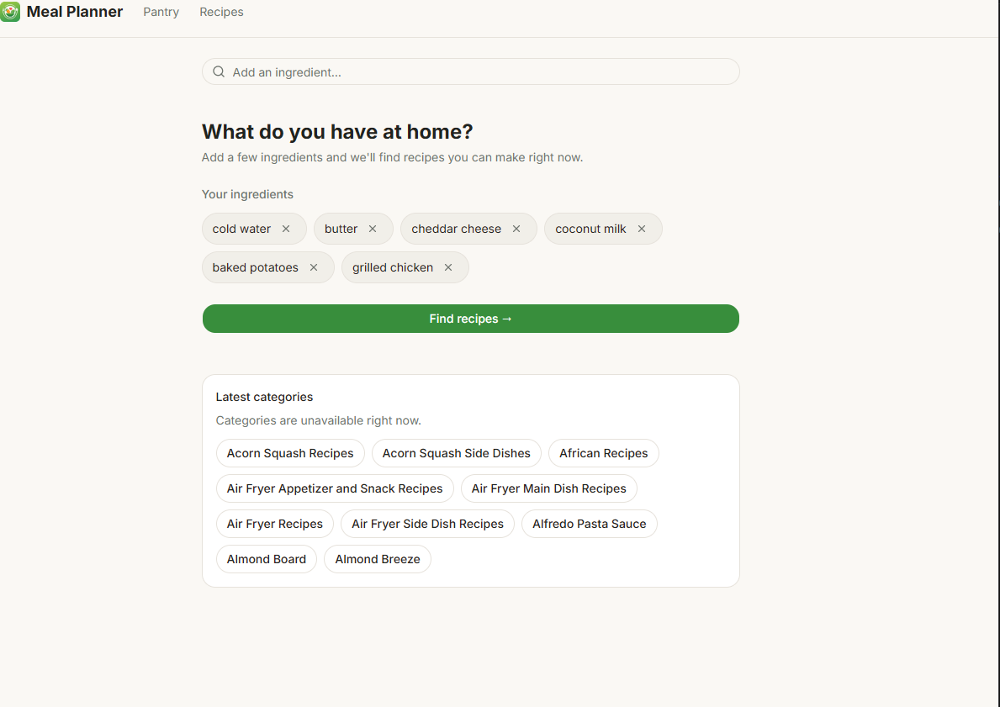
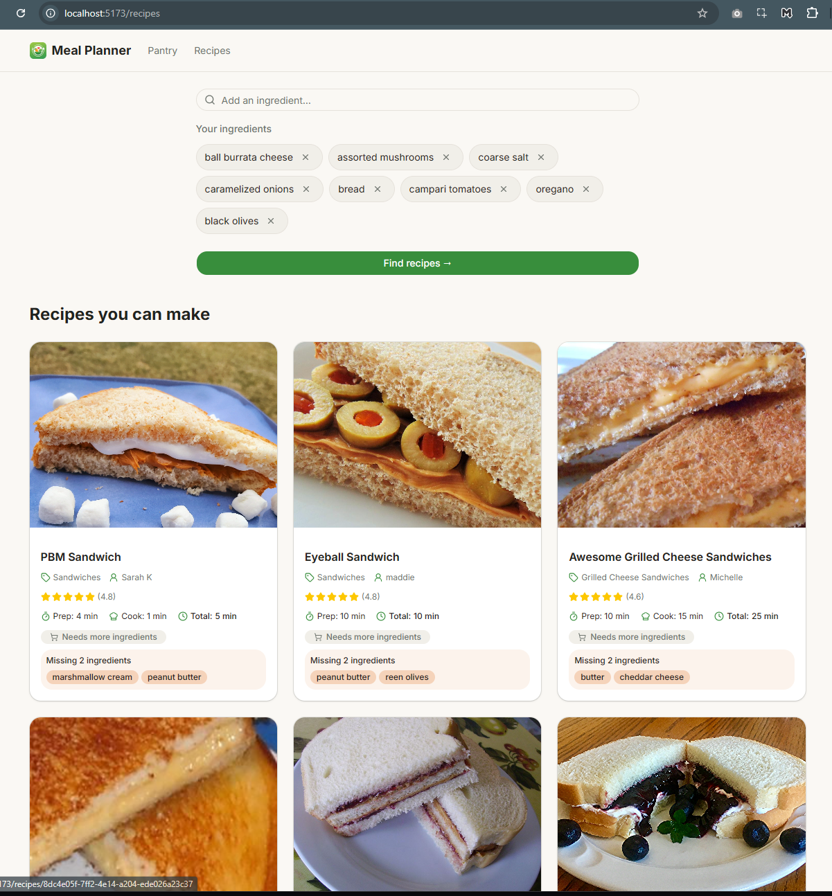
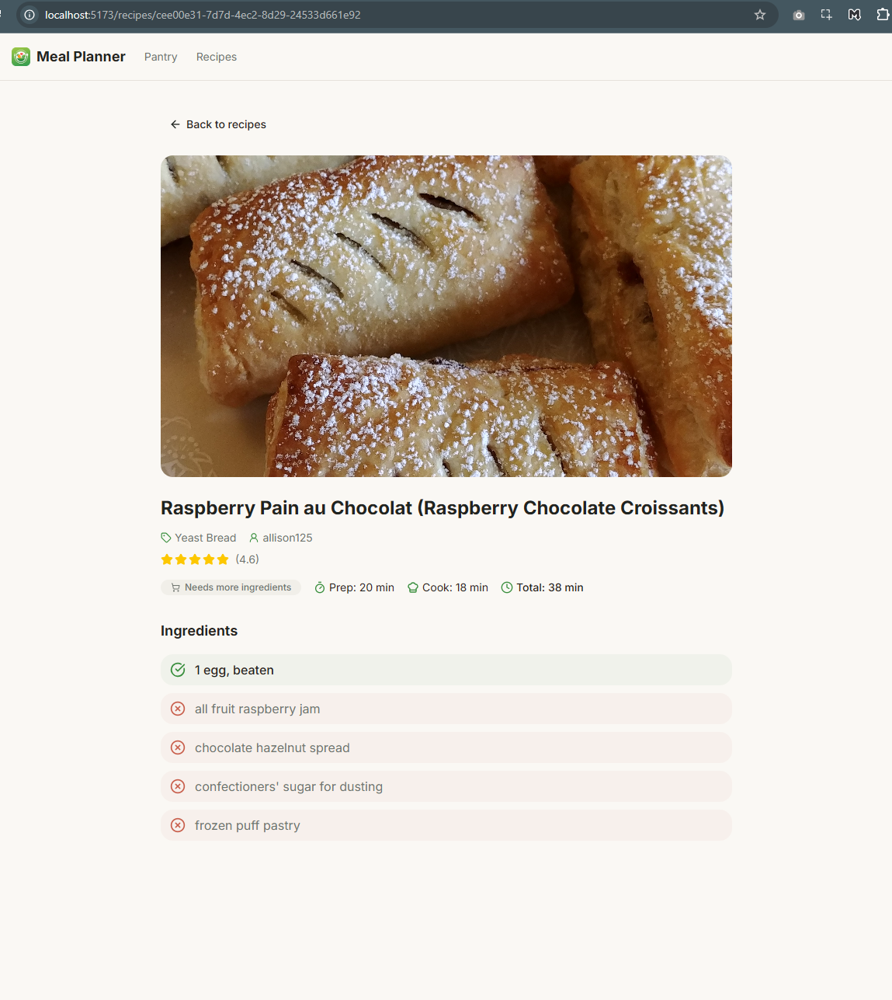
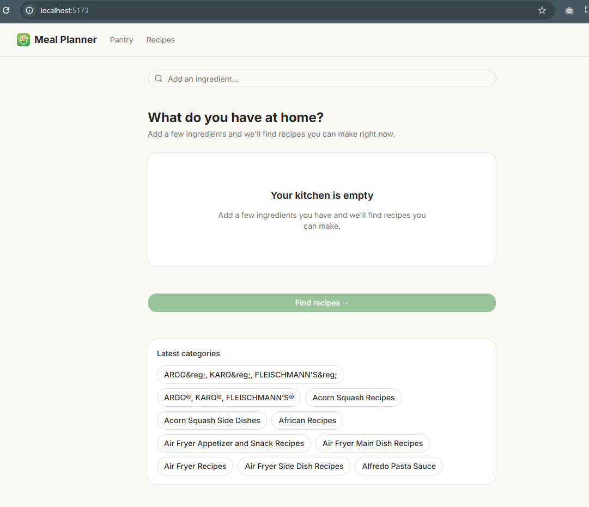
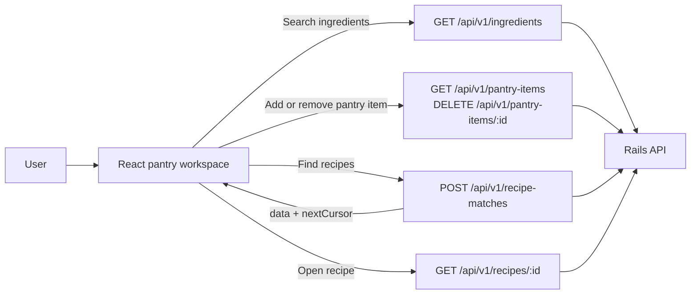
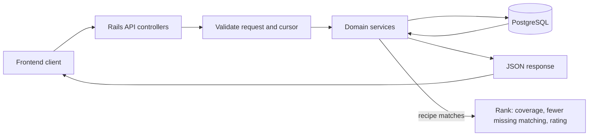

# Recipe Finder

Recipe Finder helps people decide what to cook from the ingredients they have at home. They can search the ingredient catalogue, build an anonymous pantry, and find recipes ordered by ingredient coverage, then by fewer missing ingredients and rating.






## Application

- [`frontend/`](frontend/README.md) is a React, TypeScript, and Vite single-page app. It provides pantry management, explicit recipe search, cursor-based infinite result loading, and recipe details that show owned and missing ingredients.
- [`backend/`](backend/README.md) is a Rails 8 API backed by PostgreSQL. It imports and normalizes the recipe catalogue, exposes the JSON API, maintains anonymous pantries, and calculates exact ingredient matches with cursor pagination.

## Frontend workflow



Recipe matching is explicit: editing the pantry does not replace the displayed results until the user selects **Find recipes** again.
React Query retains the current results and follows `nextCursor` as the user scrolls.

## Backend workflow



The backend imports the recipe catalogue into normalized recipe and ingredient records. Pantry endpoints use a device-local anonymous session, while recipe matches can be calculated directly from submitted ingredient IDs.

## Backend API

The API is served under `/api/v1`. Pantry endpoints require an
`X-Pantry-Session` header containing a client-generated UUID.

| Method | Path | Purpose |
| --- | --- | --- |
| `GET` | `/ingredients?q=&limit=&cursor=` | Search the canonical ingredient catalogue |
| `GET` | `/categories?limit=&cursor=` | List recipe categories |
| `GET` | `/pantry-items?limit=&cursor=` | List the current anonymous pantry |
| `POST` | `/pantry-items` | Add an ingredient with `{ "ingredientId": "..." }` |
| `DELETE` | `/pantry-items/:id` | Remove a pantry item |
| `POST` | `/recipe-matches` | Find ranked recipes from selected ingredient IDs |
| `GET` | `/recipes/:id` | Fetch recipe details with owned and missing ingredients |

Cursor-paginated responses return `{ data, nextCursor }`.

## Run locally

### Docker Compose

From the repository root, create the backend's environment file, then build and start the full development stack:

```bash
cp backend/.env.example backend/.env
docker compose up --build
```

Compose starts PostgreSQL, then creates and migrates the development database and imports the bundled recipe catalogue before starting Rails. The backend log to include:

```text
Listening on http://0.0.0.0:3000
```

The services are then available at:

| Service | URL |
| --- | --- |
| Frontend (Vite) | `http://localhost:5173` |
| Backend API (Rails) | `http://localhost:3000/api/v1` |
| PostgreSQL | `localhost:5433` |

Confirm that the imported catalogue is available with:

```bash
curl 'http://127.0.0.1:3000/api/v1/ingredients?q=honey'
curl 'http://127.0.0.1:3000/api/v1/categories?limit=1'
```

Check container status and backend logs:

```bash
docker compose ps
docker compose logs --tail=200 backend
```

Stop the stack without removing the PostgreSQL data volume:

```bash
docker compose down
```

Run the applications:

```bash
cd backend
bundle install
bin/rails db:create db:migrate
bin/rails db:seed
bin/rails server
```

```bash
cd frontend
pnpm install
pnpm dev
```

## Test and check

```bash
cd backend
RAILS_ENV=test bin/rails db:prepare
bundle exec rspec
bundle exec rubocop
bundle exec srb tc
```

```bash
cd frontend
pnpm test
pnpm lint
pnpm build
```
