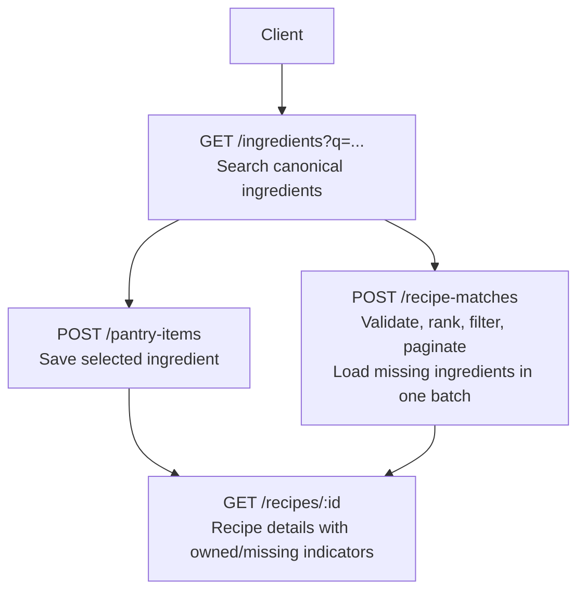
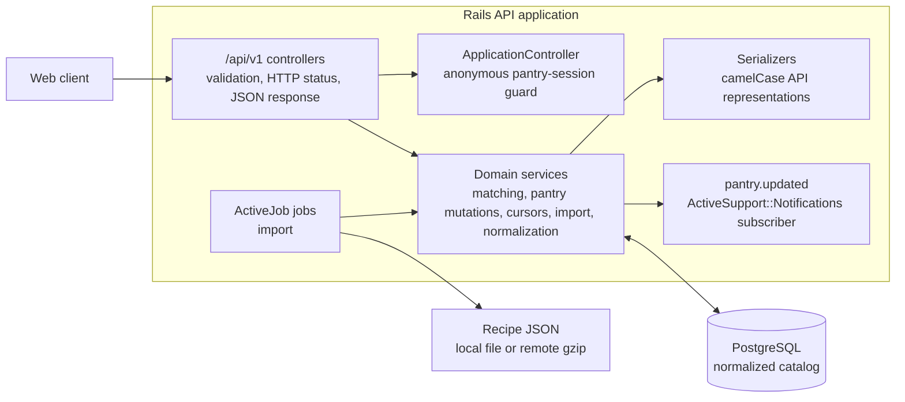
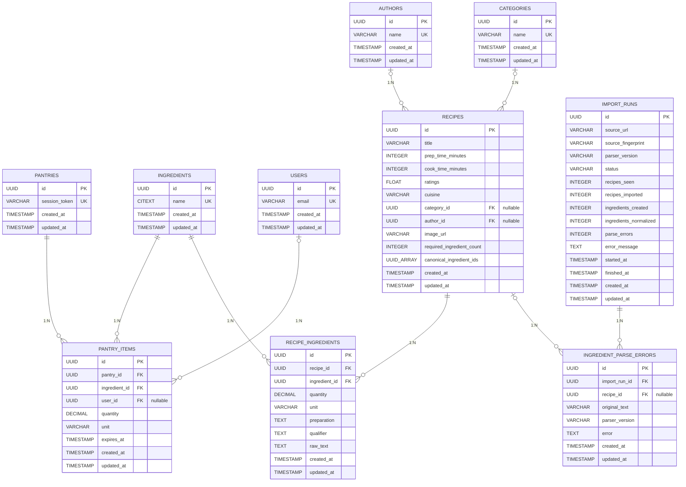
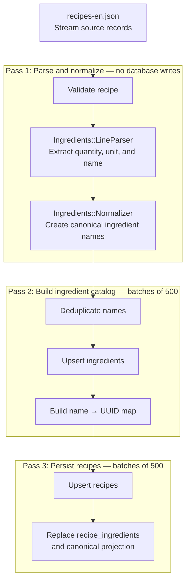
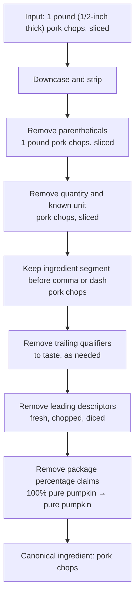
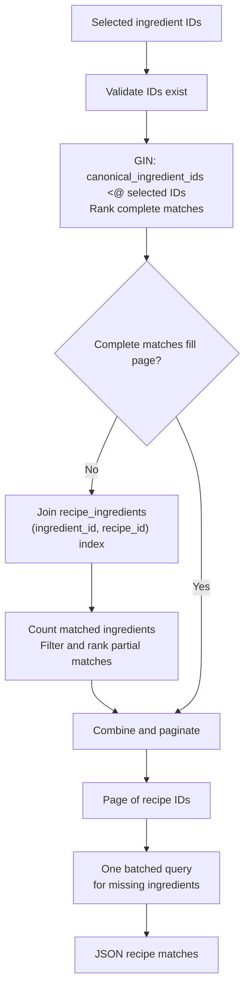

# Recipe Finder — Backend

Rails API-only backend for the recipe-matching prototype. It imports and
normalizes a recipe catalogue, keeps an anonymous pantry, and ranks recipes by
the share of their required ingredients that are selected.

## Requirements

- Ruby 3.3.8
- PostgreSQL 14+ with the `citext` and `pg_trgm` extensions available
- Bundler (`gem install bundler`)

## Setup

```bash
cd backend
gem install bundler  # if `bundle` isn't already on your PATH

# `gem install` puts executables in a user gem dir that may not be on PATH
# by default (e.g. ~/.local/share/gem/ruby/<version>/bin). If `bundle` is
# "command not found" after installing, add that dir to PATH (check with
# `gem env gemdir`) and reload your shell (`source ~/.zshrc` or a new tab).

bundle install

# Create and migrate the development database
bin/rails db:create db:migrate
# Prepare the test database when running the test suite
RAILS_ENV=test bin/rails db:migrate

# Imports db/data/recipes-en.json. It is safe to re-run: existing recipes'
# ingredient joins are rebuilt, so parser improvements repair a prior import.
# The import runs in batches and can take several minutes; consider running it
# in the background.
bin/rails db:seed
```

`config/database.yml` uses the default Postgres connection (peer auth over
the local Unix socket, current OS user as the role) — no username/password
needed locally as long as your Postgres role can create databases. Override
with `DATABASE_URL` if your setup differs.

The local seed imports the bundled JSON file. The importer streams the source
twice, records an `ImportRun`, and upserts catalogue data in batches of 500.
To synchronously import the default remote gzip source instead, run:

```bash
bin/rails runner 'ImportRecipesJob.perform_now'
```

## Running the server

```bash
bin/rails server
```

The API is served at `http://localhost:3000/api/v1`. A pantry is identified
by an `X-Pantry-Session` request header containing a client-generated UUID.
There are no user accounts; sessions are anonymous.

### Docker development

From the repository root, start the backend together with PostgreSQL (and the
frontend):

```bash
docker compose up --build
```

After PostgreSQL passes its health check, Compose removes any stale Rails PID,
creates and migrates the development database, imports the bundled catalogue,
and starts Rails at `http://localhost:3000`. The backend source is bind-mounted
for development, and the development image starts Rails through `bundle exec`
so it uses the image's installed Gemfile dependencies.

### Docker image

The production Dockerfile builds a multi-stage Rails image with only runtime
gems and packages. Build it from this directory:

```bash
docker build -t backend .
docker run -d --name backend -p 80:80 \
  -e RAILS_MASTER_KEY=<value from config/master.key> \
  -e DATABASE_URL=<production postgres URL> \
  backend
```

The container listens on port 80 and runs `db:prepare` before starting the
Rails server. Run it behind a TLS-terminating proxy in production; production
Rails has HTTPS enforcement enabled. The image contains the exact-match
relational matcher and does not require embedding or external search services.

### Endpoints

| Method | Path | Description |
|---|---|---|
| `GET`    | `/api/v1/ingredients?q=&limit=&cursor=` | Cursor-paginated canonical ingredient catalog (pantry picker) |
| `GET`    | `/api/v1/categories?limit=&cursor=` | Cursor-paginated recipe categories |
| `GET`    | `/api/v1/pantry-items?limit=&cursor=` | Cursor-paginated current pantry items (resolved via `X-Pantry-Session`) |
| `POST`   | `/api/v1/pantry-items` | Add an ingredient to the pantry (`{ "ingredientId": "..." }`) |
| `DELETE` | `/api/v1/pantry-items/:id` | Remove an ingredient from the pantry |
| `POST`   | `/api/v1/recipe-matches` | Recipes ranked by selected canonical ingredient IDs |
| `GET`    | `/api/v1/recipes/:id` | Recipe detail with owned/missing ingredient indicators |

Example:

```bash
curl -H "X-Pantry-Session: 00000000-0000-0000-0000-000000000001" \
  -X POST -H "Content-Type: application/json" \
  -d '{"ingredientId":"<uuid from /ingredients search>"}' \
  http://localhost:3000/api/v1/pantry-items

curl -X POST -H "Content-Type: application/json" \
  -d '{"ingredients":["<uuid from /ingredients search>"],"limit":20}' \
  http://localhost:3000/api/v1/recipe-matches
```

`X-Pantry-Session` must be a UUID. Recipe matching does not require a pantry
session because ingredient IDs can be submitted directly. It identifies an
anonymous pantry rather than an account; treat it as a bearer capability.
The first valid pantry request creates that session's empty pantry when needed.

`POST /api/v1/pantry-items` currently accepts only `ingredientId`. Its response also
contains nullable `quantity`, `unit`, and `expiresAt` fields, which are not
yet writable through the API.

### Recipe matching pagination

`POST /api/v1/recipe-matches` accepts:

```json
{
  "ingredients": ["<ingredient UUID>"],
  "maxMissing": 5,
  "limit": 20,
  "cursor": "<opaque cursor from the previous response>"
}
```

`limit` defaults to 20 and may be set from 1 to 100. `maxMissing` defaults
to 4 and may be set from 0 to 100. An optional `categoryId` must be a known
category UUID. The response is an
object rather than a bare array:

```json
{
  "data": [],
  "nextCursor": "<opaque cursor>"
}
```

Send `nextCursor` as `cursor` to continue. `nextCursor` is `null` on the last
page. The cursor is tied to the submitted ingredients, category, and missing
threshold, so it cannot be reused for another search. The legacy `page`
parameter is not supported.

`GET /categories` uses the same `{ data, nextCursor }` cursor response shape;
its `limit` defaults to 20 and is capped at 100. Ingredient search also
defaults to 20 and is capped at 20. Match results include category and author
objects, match counts and percentage, and the missing ingredients for each
returned recipe. Recipe detail returns the author name, parsed ingredient-line
metadata, `owned` flags, and missing ingredients for the pantry session.

Client errors use `{ "error": { "code", "message", "requestId" } }`. The API
returns `400` for a missing or malformed pantry-session header, `404` for a
resource outside the requested scope, and `422` for invalid match inputs or
duplicate pantry items.

### Pagination cursors

All four paginated endpoints share one base class, `Cursor`
(`app/services/cursor.rb`). Each cursor is a payload signed with a
purpose-scoped `Rails.application.message_verifier`, so a client cannot forge a
cursor, edit one, or replay one minted for a different endpoint — each purpose
string derives a distinct signing key.

Because signing already guarantees the payload is ours and unmodified, `decode`
validates only what signing cannot:

- **version** — a cursor signed by a previous deploy, whose payload shape has
  since changed, is still validly signed; `VERSION` is what rejects it.
- **scope** — a cursor is only meaningful inside the result set it was minted
  from. Each subclass supplies its own scope: the search query for
  `IngredientCursor`, the pantry id for `PantryItemCursor`, and the ingredient
  set + category + missing threshold for `RecipeMatchCursor`.
  `CategoryCursor` has no scope because its listing is
  unfiltered.

Field-level type checks on the decoded payload would only re-validate values the
app itself wrote one request earlier, so they are deliberately absent. A cursor
that fails either check — or whose signature does not verify — raises
`Cursor::InvalidCursor`, rescued once in `ApplicationController` into a `422`
with the message `cursor is invalid`.

Subclasses therefore carry only a purpose and a payload builder:

```ruby
class IngredientCursor < Cursor
  purpose "ingredients-cursor"

  def self.encode(ingredient, query:)
    super({ "name" => ingredient.name, "id" => ingredient.id }, scope: query)
  end

  def self.decode(value, query:)
    super(value, scope: query)
  end
end
```

Changing a cursor's payload shape invalidates cursors issued by the previously
running version. In-flight paginators receive one `422` and restart from the
first page.

### API docs (Swagger/OpenAPI)

Generated from the request specs via `rswag`:

```bash
bundle exec rails rswag:specs:swaggerize
bin/rails server
# then visit http://localhost:3000/api-docs
```

### Request workflow

The normal user journey is: choose ingredients, find matching recipes, then
open a recipe to see which ingredients are owned or missing.



`/recipe-matches` accepts selected ingredient IDs directly, so saving them to
the pantry is optional for matching. A pantry session is required for pantry
endpoints and recipe details.

## Architecture

This is a Rails 8.1 API-only modular monolith. A single application owns the
HTTP API, domain services, background jobs, and PostgreSQL persistence. There
is no user authentication or external message broker: an anonymous pantry is
created on demand from the client-supplied `X-Pantry-Session` UUID, and pantry
events are in-process `ActiveSupport::Notifications` events.



Controllers remain thin: they validate request shape, establish the current
pantry when required, call a service or query scope, and serialize the result.
The domain layer contains the substantial work: ingredient parsing and
canonicalization, streaming/batched import, pantry mutations, signed cursor
handling, and recipe matching. Active Record models express associations and
integrity rules; PostgreSQL enforces the corresponding foreign keys and unique
indexes.

Recipe matching is relational and explainable. `recipe_ingredients` is the
source of truth; `recipes.canonical_ingredient_ids` is a transactionally
maintained `uuid[]` projection with a GIN index for complete matches. Partial
matches use the normalized join table. There is no search-document table,
embedding runtime, vector index, external search service, or result cache.

The current event subscriber logs `pantry.updated`; it is an extension seam
for cache invalidation or asynchronous side effects, not a message queue.

### Database schema

The schema below is generated from the current Rails models and PostgreSQL
schema.

**Cardinality notation:** `||` = exactly one, `o|` = zero or one, and `o{` =
zero or many. Read a connector from one table to the other; for example,
`PANTRIES ||--o{ PANTRY_ITEMS` means every pantry item belongs to exactly one
pantry, while a pantry can have zero or many items.



The relationship types are:

| Relationship | Cardinality | How it is enforced |
|---|---|---|
| `pantries` → `pantry_items` | 1:N | Required `pantry_items.pantry_id` FK |
| `ingredients` → `pantry_items` | 1:N | Required FK; `(pantry_id, ingredient_id)` is unique |
| `users` → `pantry_items` | 0..1:N | Nullable `user_id`; reserved for future accounts |
| `recipes` ↔ `ingredients` | N:N | `recipe_ingredients` join table; `(recipe_id, ingredient_id)` is unique |
| `authors` → `recipes` | 0..1:N | Nullable `recipes.author_id` FK |
| `categories` → `recipes` | 0..1:N | Nullable `recipes.category_id` FK |
| `import_runs` → `ingredient_parse_errors` | 1:N | Required `import_run_id` FK |
| `recipes` → `ingredient_parse_errors` | 0..1:N | Nullable `recipe_id` FK for errors tied to a persisted recipe |

`IMPORT_RUNS` and `INGREDIENT_PARSE_ERRORS` are audit tables. Each error is
always attached to one import run and may be attached to the recipe whose line
failed parsing; malformed source data does not abort the whole import.

`USERS` exists with a nullable `pantry_items.user_id` as a prepared extension
point for accounts. Nothing in the API sets it today — pantries are still
identified solely by `session_token`.

Important indexes include the unique `(pantry_id, ingredient_id)` constraint on
`pantry_items`, the unique `(recipe_id, ingredient_id)` constraint on
`recipe_ingredients`, the recipe lookup index on `(ingredient_id, recipe_id)`,
the trigram GIN index on `ingredients.name::text` for autocomplete, and the unique
`(title, author_id)` index on `recipes` (with `nulls_not_distinct`, so
authorless duplicate titles still collide) that makes the import upsertable.

- **`required_ingredient_count` on Recipe** (denormalized): Updated whenever the shared recipe-ingredient writer replaces a recipe's ingredients. Enables filtering "recipes missing ≤ 2 ingredients" without subqueries.
- **`citext` for ingredient names**: Case-insensitive matching in queries; the trigram GIN index on `(name::text)` enables ILIKE search.
- **`pantry_id` index on pantry_items**: Keeps anonymous pantry reads and item removal efficient.
- **Recipe-backed picker catalog**: `/ingredients` returns only ingredients referenced by the current recipe import, keeping stale orphaned rows out of the pantry picker.
- **Legacy catalog guard**: percentage package claims are excluded from the picker while a re-seed repairs old imports; the importer also cleans leading and embedded claims.
- **Two-phase matching read path**: `RecipeMatcher` finds complete matches through the GIN-indexed `recipes.canonical_ingredient_ids` projection, then falls back to the normalized `(ingredient_id, recipe_id)` index only when the page still needs partial matches. Missing ingredients for the limited result page are fetched in one batched query.
- **Cursor-based pagination**: `GET /api/v1/ingredients`, `GET /api/v1/categories`, `GET /api/v1/pantry-items`, and `POST /api/v1/recipe-matches` return `{ data, nextCursor }`. Pass the opaque `nextCursor` as `cursor` to fetch the next page; `page` is not supported for matching. Cursors are signed and scoped to the search they were minted from — see [Pagination cursors](#pagination-cursors).
- **PostgreSQL UUIDs**: model and bulk-import writes use PostgreSQL's `gen_random_uuid()` defaults consistently; bulk operations do not depend on model callbacks.

## Data ingestion

`RecipeSeeder` remains the compatibility entry point; `RecipeImport::Importer` owns the import workflow. It streams the source twice and persists batches of 500 records rather than issuing a query per ingredient line. Its JSON-array reader tracks quoted strings and escapes, so escaped quotes inside source fields do not break record boundaries. Re-running it replaces each imported recipe's join rows and refreshes the canonical-ID projection, so parsing and normalization changes repair existing imports.

### Ingestion pipeline



### Normalization pipeline (detailed)

`Ingredients::Normalizer` is a series of syntactic transformations. It **never merges ingredients** — "almond flour" stays separate from "flour". Accuracy over recall: false merges break recipes.



**Compound splitting** ("salt and black pepper"): Only splits if **both halves already exist as ingredients** in the corpus. This prevents false splits like "garlic and herb seasoning" (where "herb seasoning" isn't an ingredient by itself).

### Deliberate current boundaries

- `recipe_ingredients` remains the normalized source of truth. The
  GIN-indexed `canonical_ingredient_ids` projection is maintained in the same
  transaction by `RecipeIngredients::Replace`; direct association writes are
  not supported.
- The importer is idempotent, streaming, and bulk-oriented. It makes two
  passes over the source (catalogue, then persistence) and records import-run
  audit data and parser versioning. The remote-import job downloads the gzip
  source to a bounded temporary file before streaming each pass.
- `recipe_ingredients` is intentionally distinct by `(recipe_id,
  ingredient_id)` because matching is availability-based rather than
  quantity-based. If preserving duplicate source lines becomes a product
  requirement, introduce a separate ordered ingredient-line model while
  retaining the distinct relation as the matching projection.

## Recipe matching algorithm (RecipeMatcher)

The `POST /api/v1/recipe-matches` endpoint ranks recipes by the **percentage
of each recipe's required canonical ingredients that are selected**, then by
fewer missing ingredients, then by rating. The complete-match phase uses an
indexed per-recipe projection.
Only when that phase cannot fill the requested page does the matcher count
normalized `recipe_ingredients` rows for partial matches.

### Matching workflow

After the controller validates the submitted UUIDs, matching finds complete
matches first and queries normalized rows only for the remaining partial slots:



The endpoint validates the submitted ingredient IDs, finds and ranks up to
`limit + 1` recipes, and loads missing ingredients for the returned page in a
single batch. The last step does not issue one query per recipe (no N+1 query).
The opaque cursor records whether it ended in the complete or partial phase,
so a transition between the two cannot skip or repeat results and avoids offset
scans.

### Scaling options

`recipes.canonical_ingredient_ids` is a sorted, distinct `uuid[]` projection
kept transactionally in sync with `recipe_ingredients`. Its GIN index serves
the complete-match phase (recipes whose full canonical ingredient set is
contained in the selected IDs). Partial matching remains normalized and uses
the ingredient-leading `recipe_ingredients` index, because exact partial-match
ranking still has to count the selected ingredients for every candidate.

The current workload does not use a materialized view, cache table, external
search service, or vector store. Add one only after production query profiling
shows that the relational path is not meeting the required latency.


### Match percentage calculation

For each recipe in the result set:

- **matched** = count of recipe ingredients included in the selected IDs
- **required** = `recipe.required_ingredient_count` (stored at seed time)
- **match %** = `matched / required × 100`
- **missing** = `required - matched` (must be ≤ the `max_missing` threshold to include recipe)

**Example**: Recipe requires 8 ingredients, pantry has 6 of them:
- matched = 6
- required = 8
- match % = 75%
- missing = 2

This recipe is included if the threshold allows ≥ 2 missing ingredients.

## Testing

```bash
bundle exec rspec
```

Covers model specs, import and matching service specs, and direct request specs
for every API endpoint. Request coverage includes session validation, pantry
ownership, duplicate item rejection, cursor metadata, pagination validation,
404 responses, and no-N+1 query-count assertions.

`spec/services/cursor_spec.rb` exercises the shared cursor layer once —
round-trip, tampering, scope mismatch, and replay across cursor classes — rather
than repeating those cases per endpoint.

## Linting & static typing

```bash
bundle exec rubocop        # style (rubocop-rails-omakase base + rspec/performance cops)
bundle exec rubocop -A     # auto-fix
bundle exec srb tc         # Sorbet typecheck (scoped to app/services)
```

Sorbet RBIs are generated via [Tapioca](https://github.com/Shopify/tapioca) and
are committed with the code they describe:

```bash
bundle exec tapioca gems  # after Gemfile.lock changes
bundle exec tapioca dsl   # after model, association, or schema changes
bundle exec srb tc        # verify the generated RBIs and service types
```

`tapioca dsl` boots Rails, so PostgreSQL must be available. Commit the resulting
changes under `sorbet/rbi/` with the related dependency or application change.

## Domain events

Pantry mutations publish an `ActiveSupport::Notifications` event
(`pantry.updated`) that `app/events/pantry_subscriber.rb` logs — an
in-process seam for future cache invalidation, no external broker.

## Further improvement: semantic recipe discovery

The current matcher is intentionally exact and explainable: recipes are ranked
by canonical ingredient coverage. A future semantic-discovery feature could
also support intent-based searches such as “quick vegetarian comfort food” and
surface recipes whose wording does not exactly match the user’s query.

That capability should be a separate candidate-generation stage: embed recipe
content and the user query, retrieve a bounded candidate set with a vector
index, then apply the existing exact ingredient and dietary filters before
ranking. Exact ingredient coverage should remain the explanation shown to the
user and the source of truth for match ranking.

This is not part of the current runtime. It would require an embedding
provider, a vector-capable PostgreSQL extension and table, background
generation/backfill jobs, and a product decision about how semantic candidates
interact with exact-match pagination.

### Production deployment

The checked-in `config/deploy.yml` is a Kamal template. Before deploying,
replace its server, registry, and proxy values, then provide secrets through
your deployment environment:

- `RAILS_MASTER_KEY`
- `DATABASE_URL` (or the database password expected by `config/database.yml`)
- `FRONTEND_ORIGIN` (the exact HTTPS origin allowed to call the API)

The Rails container runs `db:prepare` on boot.

Production enables HTTPS enforcement and keeps `/up` available for health
checks. Configure the deployment's TLS-terminating proxy before deploying.

## Project structure

```
app/
  controllers/api/v1/      # thin controllers: ingredients, categories,
                           # pantry items, recipe matches, recipe detail
  errors/api/              # Api::InvalidRequest, rescued into 422 responses
  events/                  # PantrySubscriber — ActiveSupport::Notifications
  jobs/                    # ImportRecipesJob
  models/                  # Recipe, Ingredient, RecipeIngredient, Author,
                           # Category, Pantry, PantryItem, User, ImportRun,
                           # IngredientParseError
  serializers/             # lightweight camelCase JSON modules
  services/
    ingredients/           # LineParser, Normalizer, and ResolveInput
    recipe_import/         # Importer, BatchWriter, JsonArrayStream,
                           # RecipeValidator
    pantry_items/          # Create, Destroy (publish `pantry.updated`)
    recipe_matcher.rb      # matching algorithm
    cursor.rb              # signed-cursor base: verify, version, scope
    ingredient_cursor.rb, category_cursor.rb,
    pantry_item_cursor.rb, recipe_match_cursor.rb
                           # Cursor subclasses: a purpose + a payload builder
    recipe_seeder.rb       # compatibility entry point for the importer
config/
  initializers/pantry_events.rb   # subscribes PantrySubscriber in to_prepare
  initializers/cors.rb            # /api/v1/* only, FRONTEND_ORIGIN in prod
  deploy.yml                      # Kamal deployment template
  ci.rb                           # pipeline run by bin/ci
db/
  migrate/
  data/recipes-en.json     # source dataset
  schema.rb
  seeds.rb
spec/
  models/                  # Recipe, Ingredient, Author, Category
  services/                # matcher, seeder, cursor, recipe_import/recipe_validator
  requests/api/v1/         # every endpoint, written in the rswag DSL
  factories/, support/     # FactoryBot factories, QueryCounter for N+1 asserts
sorbet/                    # Sorbet config and Tapioca-generated RBIs
swagger/                   # generated OpenAPI document served at /api-docs
```
