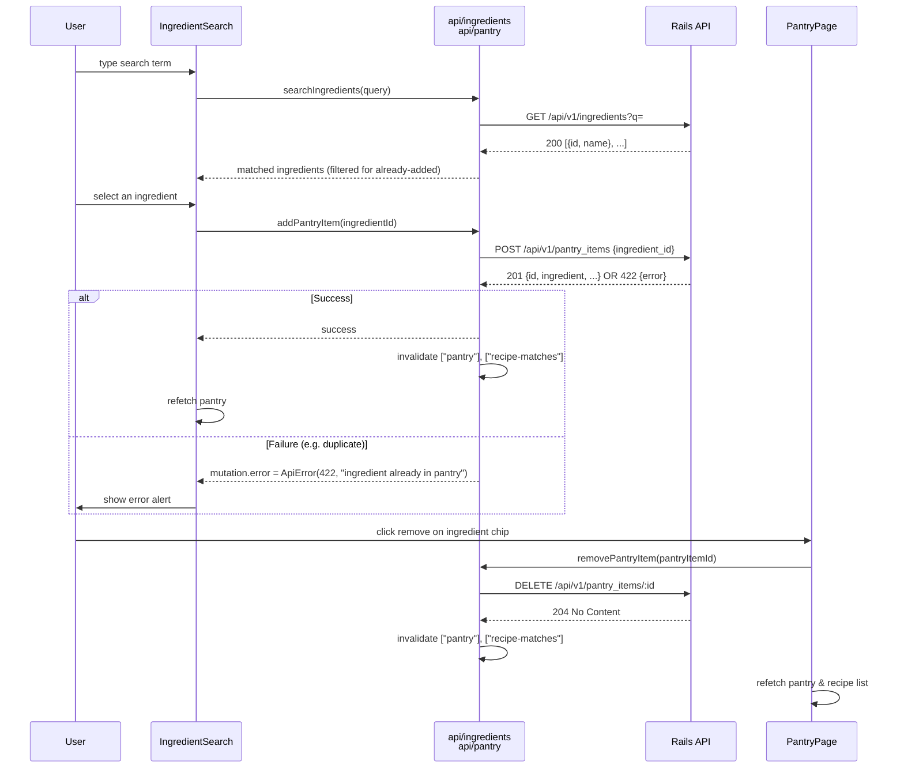
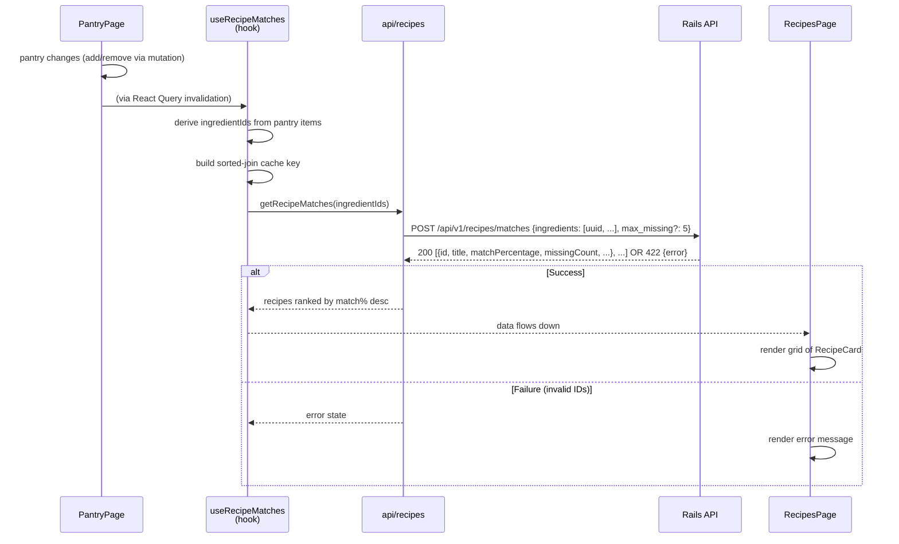
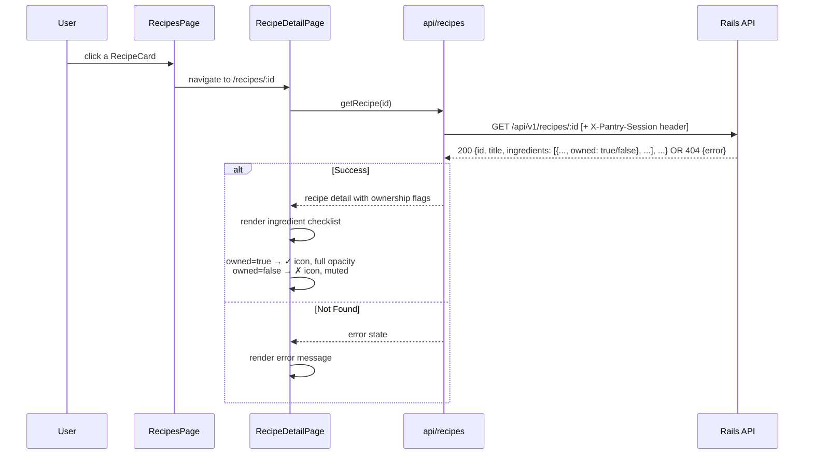

# Dinner Time — Frontend

## Overview

A React + TypeScript + Vite single-page application that helps home cooks discover recipes they can prepare **right now** with ingredients they already have at home. Users build an anonymous pantry, and the app ranks recipes by how close a match they are—fewest missing ingredients, highest match percentage. No login required; pantries are anonymous and session-local.

Built as a Pennylane take-home challenge, consuming a Rails 8 API backend.

## User Stories

- **As a home cook**, I want to search for and add ingredients I have at home to my pantry, so the app knows what I can work with today.
- **As a home cook**, I want to see a ranked list of recipes I can make with my current pantry (sorted by match %, with clear missing-count badges), so I can quickly decide what to cook tonight without extra shopping.
- **As a home cook**, I want to open a recipe and see exactly which ingredients I already own vs. still need to buy, so I can make a focused shopping list if needed.

## Setup

### Prerequisites
- **Node.js** with pnpm (or npm/yarn; this project uses pnpm)
- **Backend running** on `http://localhost:3000`; CORS is already configured there for the frontend's dev server

### Installation

1. **Install dependencies:**
   ```bash
   pnpm install
   ```

2. **Configure the API base URL (optional):**
   ```bash
   cp .env.example .env
   ```
   Edit `.env` if the backend runs on a different port:
   ```
   VITE_API_BASE_URL=http://localhost:3000
   ```
   (Defaults to `http://localhost:3000` if the env var is unset.)

3. **Start the dev server:**
   ```bash
   pnpm dev
   ```
   App runs at `http://localhost:5173` (Vite default).

4. **Build for production:**
   ```bash
   pnpm build
   ```

## Architecture

### Folder Structure

```
src/
├── api/                    # API fetch wrappers, one file per resource
│   ├── client.ts           # fetch wrapper, ApiError, session token persistence
│   ├── types.ts            # TypeScript interfaces (Ingredient, PantryItem, RecipeMatch, RecipeDetail)
│   ├── ingredients.ts      # searchIngredients(query)
│   ├── pantry.ts           # getPantry, addPantryItem, removePantryItem
│   └── recipes.ts          # getRecipeMatches, getRecipe
├── hooks/                  # React Query hooks wrapping the api/ layer
│   ├── useIngredientSearch.ts
│   ├── usePantry.ts        # usePantry, useAddPantryItem, useRemovePantryItem
│   ├── useRecipeMatches.ts
│   └── useRecipe.ts
├── pages/                  # Route-level containers (own loading/error/empty states)
│   ├── PantryPage.tsx      # "/"        — ingredient search, pantry management
│   ├── RecipesPage.tsx     # "/recipes" — ranked recipe list
│   └── RecipeDetailPage.tsx # "/recipes/:id" — recipe detail with owned/missing checklist
├── components/             # Reusable presentational components
│   ├── EmptyState.tsx
│   ├── IngredientChip.tsx
│   ├── IngredientSearch.tsx
│   ├── MatchBadge.tsx
│   ├── RecipeCard.tsx
│   └── ui/                 # shadcn/ui primitives (badge, button, card, input, etc.)
├── lib/utils.ts            # cn() utility for Tailwind + clsx
├── App.tsx                 # Router setup, main nav header
├── main.tsx                # Entry point, React Query client provider
└── index.css               # Tailwind v4 CSS-first theme config
```

### Data Flow

```
api/*
  ↓ (fetch wrappers with X-Pantry-Session persistence)
  ↓
hooks/*
  ↓ (React Query queries/mutations with cache invalidation logic)
  ↓
pages/*
  ↓ (route-level containers, loading/error/empty state UX)
  ↓
components/*
  ↓ (presentational, receive data + callbacks via props)
  ↓
ui/*
  ↓ (shadcn primitives)
  ↓
DOM
```

### React Query Caching & Invalidation

**Query keys:**
- `["pantry"]` — list of pantry items; invalidated on add/remove
- `["recipe-matches", <sorted-ingredient-id-key>]` — recipe matches for current pantry; the key includes a sorted join of ingredient IDs to ensure distinct sets produce distinct cache entries (prevents stale data on ingredient swaps)
- `["recipe", id]` — a specific recipe's detail, including owned/missing per ingredient
- `["ingredient-search", query]` — autocomplete suggestions for the given search term

**Invalidation strategy:**
- `useAddPantryItem` and `useRemovePantryItem` mutations invalidate both `["pantry"]` and `["recipe-matches"]` prefix on success
- This causes the pantry list and the ranked recipe list to refetch automatically whenever the user's pantry changes
- No need for manual refetch calls or imperative state management

## Workflows

### Pantry Management (Add / Remove Ingredients)



### Recipe Matching (Search Pantry, Fetch Ranked Matches)



### Recipe Detail View (Owned vs. Missing Ingredients)



## Testing

### Test Pyramid

**Unit & component tests (today):** Vitest + React Testing Library  
- API error handling and JSON body message parsing
- React Query hooks (query success/error, mutation invalidation)
- Page-level user flows (search → add → remove ingredient, recipe matching, recipe detail rendering)
- Individual components and their state management

**End-to-end tests (planned, not yet built):**  
Playwright specs (`@playwright/test` already installed, `e2e/` folder scaffolded) for future coverage of:
1. **Happy path:** search → add 2–3 ingredients → view ranked recipe list → open a recipe → verify owned/missing checklist → remove an ingredient → confirm recipe list updates
2. **Error handling:** attempt to add the same ingredient twice, verify inline error message with backend's actual error text
3. **Edge cases:** empty pantry state, no-match state (all recipes have too many missing ingredients), loading states

### Key Test Cases by Flow

| User Flow | Test File(s) | Key Cases |
|---|---|---|
| Pantry add/remove | `PantryPage.test.tsx` | add success, remove success, mutation error displayed, empty-state guard, loading state |
| Recipe matching | `useRecipeMatches.test.tsx` | correct POST body with ingredient IDs, empty-pantry disabled, cache-key correctness on ingredient swap |
| Recipe detail | `RecipeDetailPage.test.tsx` | loading state, error/404 state, full render (title/times/author), owned/missing icon rendering, route param handling |
| Pantry hooks | `usePantry.test.tsx` | query success, add/remove mutations invalidate both keys, error state population |
| API error handling | `api-error.test.tsx` | parse backend `{error}` JSON body, fallback to generic message |
| Existing coverage | `RecipesPage.test.tsx`, `RecipeCard.test.tsx`, `IngredientChip.test.tsx` | already present from scaffolding |

### Running Tests

```bash
# Run tests once (CI mode)
pnpm test

# Run tests in watch mode
pnpm test:watch
```

## Known Limitations / Future Improvements

- **No pagination UI:** The backend supports `limit` and `page` params on `/recipes/matches`, but the frontend always uses the backend defaults (50 recipes per page). A future enhancement could add pagination controls.
- **No `max_missing` tolerance UI:** Users cannot adjust the "how many missing ingredients are acceptable?" threshold from the UI (backend default is 5). Could add a slider or dropdown to expose this.
- **Unused recipe fields:** The backend's `GET /api/v1/recipes/:id` response includes `quantity`, `unit`, `preparation`, and `qualifier` for each ingredient line (parsed from the recipe), but these are not modeled in `src/api/types.ts` or displayed in the UI. Could extend the type and show formatted quantities (e.g., "1 lb chicken, diced, divided").
- **Generic error messages for mutations:** Error messages shown to the user are parsed from the backend's `{error}` field if present, but not all HTTP error responses include that field. In edge cases, users see generic "Request to ... failed with 422" text. This is acceptable for an MVP but could be improved with more specific backend error formatting.
- **No image handling for missing URLs:** Recipe images are rendered as-is; if a recipe has `imageUrl: null`, no fallback or placeholder is shown (the `` is skipped entirely). Could add a gray placeholder card.
- **Playwright e2e suite not built:** Scaffolding exists but specs are not written. See "End-to-end tests (planned, not yet built)" above.

## Architecture Rationale

- **React + TypeScript + Vite:** Modern, fast dev loop with HMR, type safety, and minimal config
- **TanStack Query (react-query):** Handles caching, invalidation, and request deduplication without Redux or context boilerplate
- **Tailwind CSS v4 (CSS-first):** Single source of truth for design tokens and utility classes; no separate `tailwind.config.js`
- **shadcn/ui primitives:** Unstyled, accessible, composable base components; easy to restyle and extend
- **Vitest + React Testing Library:** Fast tests, modern APIs, mocks at the module level (no Jest)
- **Anonymous pantry sessions (no login):** Simpler UX, no backend user management needed; trade-off is that pantries are device-local (no sync across devices)
- **Stateless recipe matching:** `POST /recipes/matches` takes ingredient IDs directly rather than reading from a server-side pantry, allowing matches to be computed without persistence and enabling client-side ingredient selection before saving to a pantry

## Development

- **Linting:** `pnpm lint` (oxlint; no ESLint or Prettier config)
- **Type checking:** Included in `pnpm build` (`tsc -b`); not a separate step
- **Hot Module Replacement (HMR):** Automatic on `pnpm dev`; changes appear instantly

## Contributing

Familiarize yourself with:
- The data flow diagram and test cases above
- The React Query invalidation strategy (mutate → invalidate → refetch)
- Existing patterns in `src/api/*`, `src/hooks/*`, `src/pages/*`, and `src/__tests__/*`
- The `.env.example` setup for pointing to a different backend if needed
