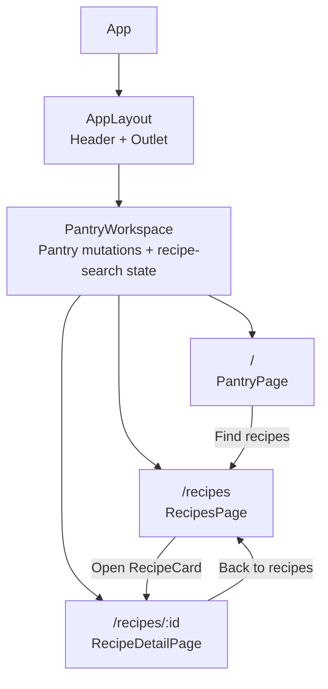
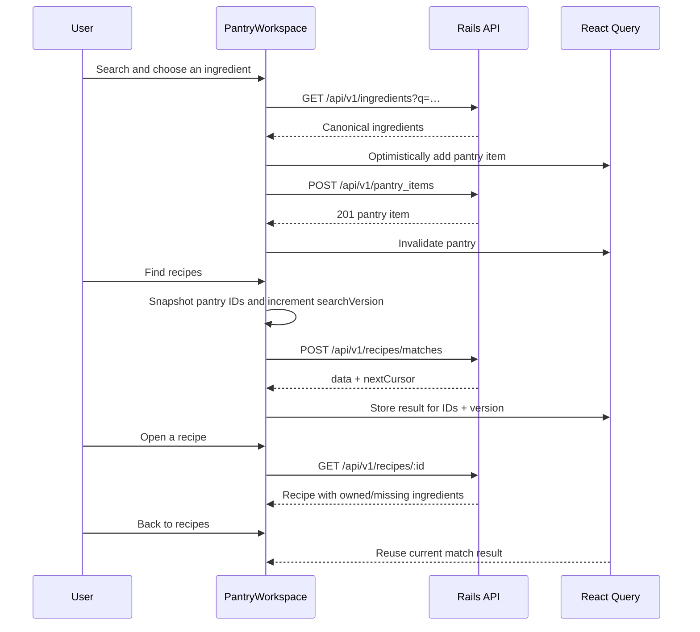
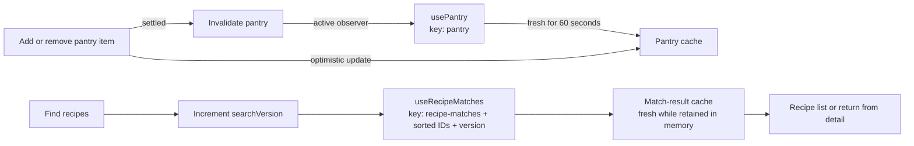
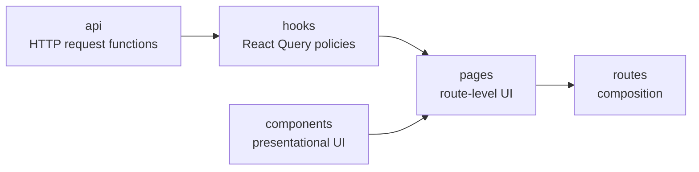

# Meal Planner — Frontend

React, TypeScript, and Vite single-page application for finding recipes from
an anonymous pantry. It consumes the Rails API in `../backend`, lets a user
search and save ingredients, then ranks recipes by the selected ingredients.

## What it does

- Creates a device-local anonymous pantry session; no sign-in is required.
- Searches canonical ingredients with a 300 ms debounce.
- Adds and removes pantry ingredients with optimistic updates.
- Shows the latest ten recipe categories on the pantry page.
- Runs an explicit, cursor-paginated recipe-match search.
- Shows recipe details with pantry-aware owned and missing ingredients.
- Preserves the current search and its cached result while moving between a
  recipe list and recipe detail.

## Setup

### Prerequisites

- Node.js and pnpm
- The backend running locally, normally at `http://localhost:3000`

### Install and run

```bash
cd frontend
pnpm install
cp .env.example .env
pnpm dev
```

Vite serves the app at `http://localhost:5173` by default. Configure a
different API in `.env` when needed:

```dotenv
VITE_API_BASE_URL=http://localhost:3000
```

If unset, `VITE_API_BASE_URL` defaults to `http://localhost:3000`.

## Scripts

```bash
pnpm dev          # start Vite with HMR
pnpm test         # run Vitest once
pnpm test:watch   # run Vitest in watch mode
pnpm lint         # run oxlint
pnpm build        # type-check and create a production build
pnpm preview      # serve the production build locally
```

## Docker deployment

The included multi-stage `Dockerfile` builds the Vite bundle and serves it
with unprivileged Nginx on port 8080. It caches fingerprinted assets for one
year and sends unknown paths to `index.html`, which keeps client-side routes
such as `/recipes/:id` working after a direct request or browser refresh.

```bash
docker build \
  --build-arg VITE_API_BASE_URL=https://api.example.com \
  -t meal-planner-frontend .

docker run --rm -p 8080:8080 meal-planner-frontend
```

`VITE_API_BASE_URL` is compiled into the browser bundle, not read when the
container starts. Build a new image for each API URL. Configure the backend's
`FRONTEND_ORIGIN` with the public frontend origin so its CORS policy permits
the browser requests.

## Routes and state

`AppRoutes` renders all routes inside `AppLayout` and
`PantryWorkspace`. The workspace owns selected ingredient IDs and a
`searchVersion`, so it stays mounted for both the recipe list and detail
page. Returning from detail therefore does not reset the search.



The ingredient search is displayed on `/` and `/recipes`, but hidden on
`/recipes/:id`. The workspace itself remains mounted in every case.

## Main workflow



Recipe matching happens only after **Find recipes** is pressed. Changing the
pantry does not replace an already displayed match snapshot; pressing the
button again deliberately creates a new search.

## API integration

`src/api/client.ts` is the shared fetch wrapper. It sends JSON, turns failed
responses into `ApiError`, and includes `X-Pantry-Session` on every
request. The client stores the session UUID in `localStorage` under
`pantry_session_token`; clearing browser storage starts a new pantry.

| Feature | Backend request | Purpose |
| --- | --- | --- |
| Ingredient search | `GET /api/v1/ingredients?q=` | Autocomplete suggestions |
| Categories | `GET /api/v1/categories?limit=10` | Latest categories |
| Pantry | `GET /api/v1/pantry` | Current anonymous pantry |
| Add pantry item | `POST /api/v1/pantry_items` | Save an ingredient |
| Remove pantry item | `DELETE /api/v1/pantry_items/:id` | Remove an ingredient |
| Match recipes | `POST /api/v1/recipes/matches` | Ranked, cursor-paginated results |
| Recipe detail | `GET /api/v1/recipes/:id` | Owned and missing ingredient display |

The match request sends `ingredients` plus optional `max_missing`,
`limit`, and `cursor` fields. The UI uses backend defaults for optional
filters and follows `nextCursor` through the intersection-observer
pagination hook.

## Caching and mutations

React Query caching is in memory only; a browser refresh starts a new cache.
Mutable pantry data and an explicit match snapshot use different policies.



- Pantry queries have a 60-second `staleTime`. Add/remove mutations invalidate
  them immediately so the client reconciles with the server.
- Match queries include sorted IDs and `searchVersion` in the key. They use
  `staleTime: Infinity`, so returning from detail reuses a retained result
  instead of issuing another match request.
- A new **Find recipes** action increments the version and creates a new query
  for the current pantry selection.

## Project structure

Tests are co-located with the source they verify. Shared code remains at the
top level; product code is organised by feature.

```text
src/
├── App.tsx / App.test.tsx
├── api/
│   ├── client.ts / client.test.tsx    # fetch, session header, ApiError
│   └── types.ts                       # API response types
├── components/                        # shared UI and shared tests
├── features/
│   ├── categories/{api,components,hooks}
│   ├── pantry/
│   │   ├── api/
│   │   ├── components/                # IngredientSearch, PantryWorkspace
│   │   ├── hooks/                     # usePantry, useIngredientSearch
│   │   └── pages/                     # PantryPage
│   └── recipes/
│       ├── api/
│       ├── components/                # cards, metadata, image, ingredients
│       ├── hooks/                     # matches, detail, infinite scroll
│       └── pages/                     # RecipesPage, RecipeDetailPage
├── layouts/AppLayout.tsx
├── routes/AppRoutes.tsx
├── test/                              # setup, render helpers, factories
└── main.tsx                            # providers and browser router
```



## Testing

The suite uses Vitest, React Testing Library, and jsdom. It covers shared API
error handling, React Query hooks, pages, presentational components, and the
recipe-list → detail → back-to-list regression.

```bash
pnpm test
pnpm lint
pnpm build
```

## Deployment

```bash
cd /home/violeta/projects/pennylane/girls-incode

sudo docker build \
  --build-arg VITE_API_BASE_URL=http://localhost:3000 \
  -t meal-planner-frontend:test \
  frontend

sudo docker run --rm -p 8080:8080 meal-planner-frontend:test
```

## Current boundaries

- Pantry sessions are anonymous and local to one browser profile; there is no
  login or cross-device synchronisation.
- The UI does not currently expose category, `max_missing`, or match-limit
  controls, although the API accepts them.
- Recipe detail shows original ingredient text and ownership state; richer
  parsed ingredient metadata is not displayed separately.
