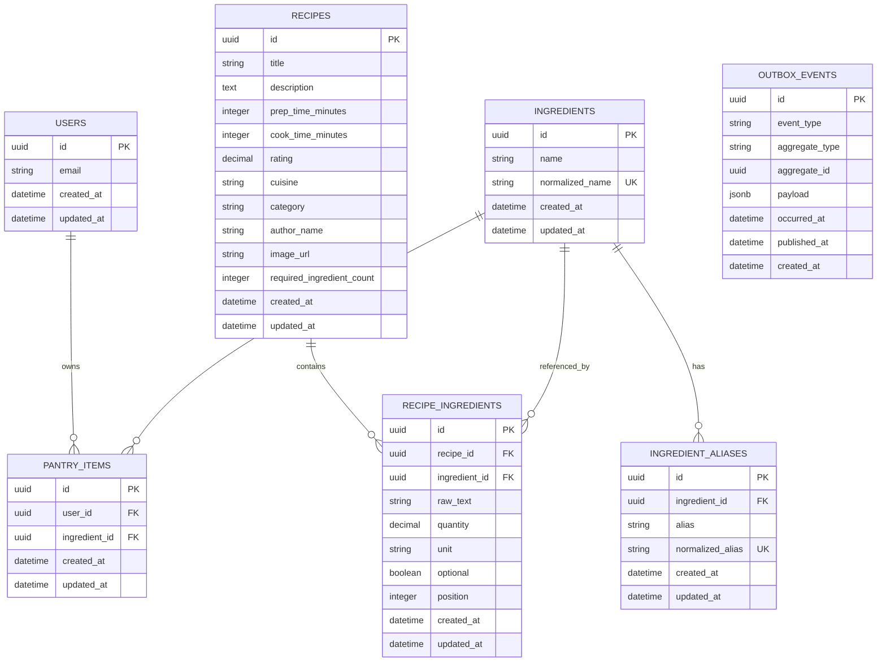
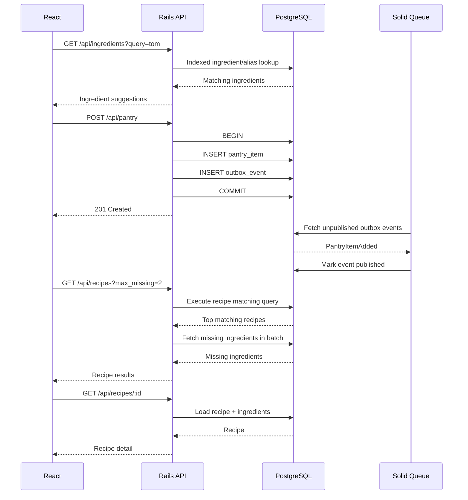
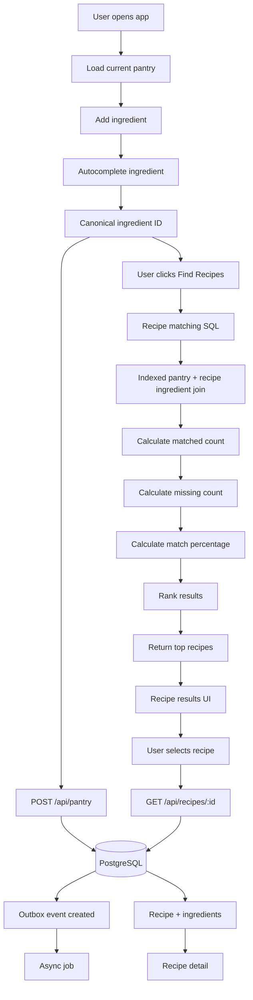
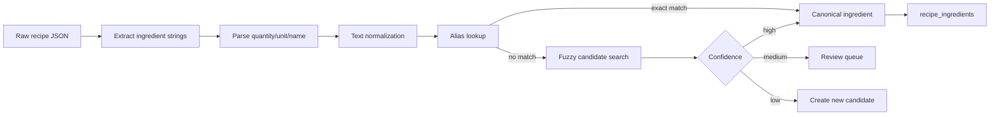
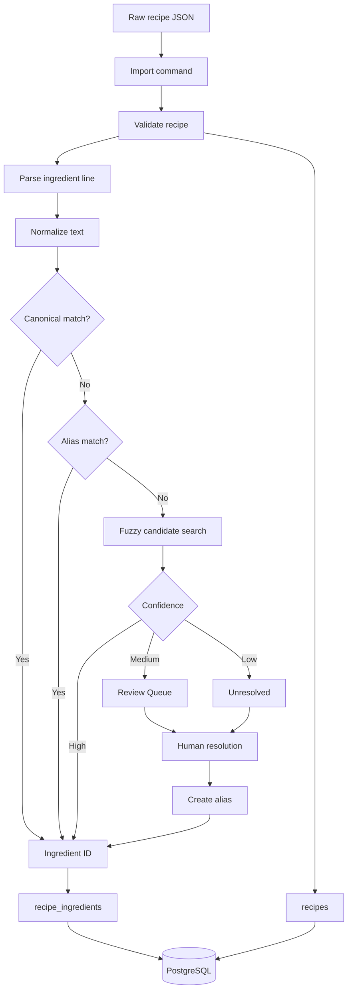
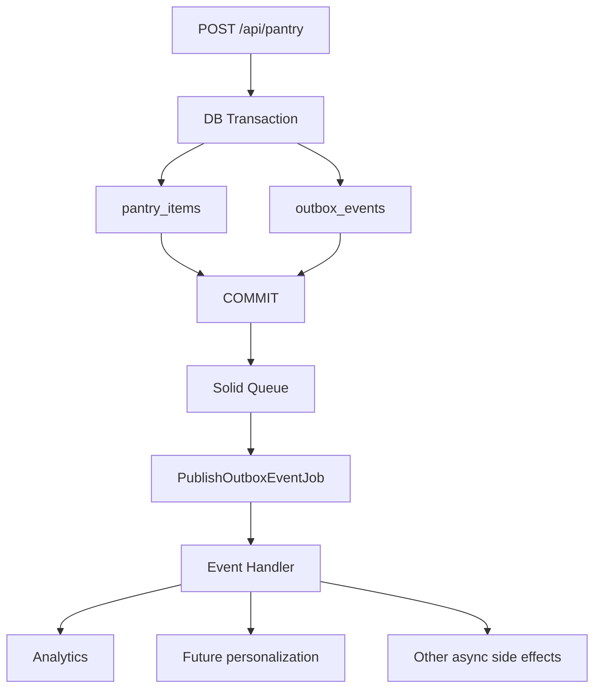
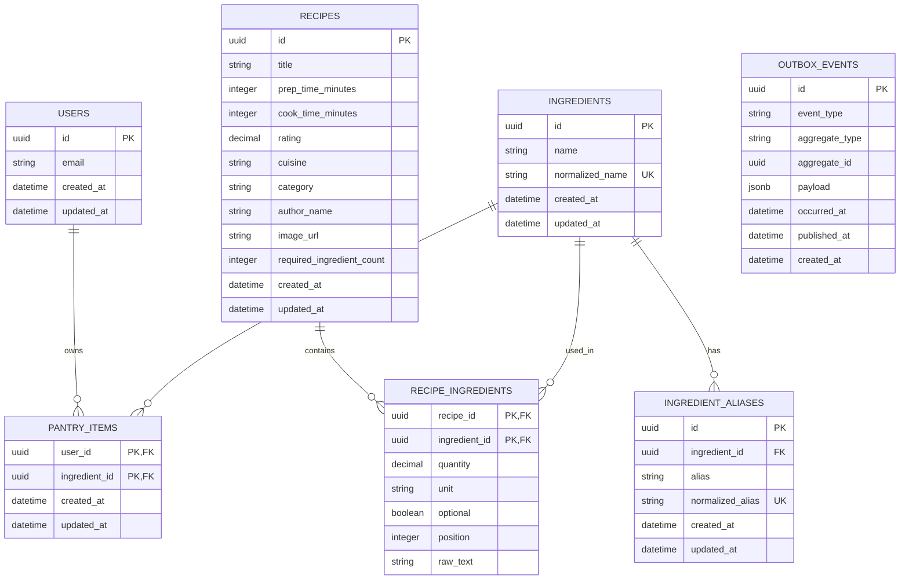
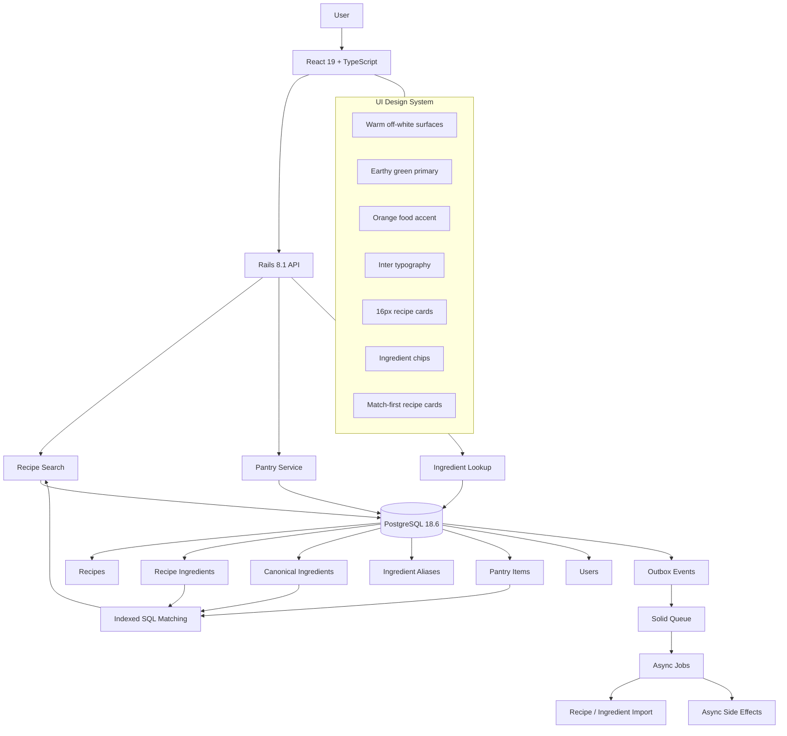

# Recipe Finder Backend Architecture

## 1. Backend Architecture

The backend should follow one principle:

> Normalize ingredients once at ingestion time, then make recipe matching an indexed SQL aggregation. Do not parse or compare ingredient strings during every search.

Target stack:

- Ruby on Rails 8.1.3.1
- PostgreSQL 18
- React 19 + TypeScript 5.9 on the frontend
- Jest 30 for frontend unit tests
- Rails-native backend tests
- Solid Queue / Active Job for lightweight asynchronous processing

Architecture:

```text
React / TypeScript
        │
        │ HTTP JSON
        ▼
┌──────────────────────────────┐
│ Rails API                    │
│                              │
│ Controllers                  │
│     ↓                        │
│ Application services         │
│     ↓                        │
│ Query objects                │
│     ↓                        │
│ ActiveRecord                 │
└──────────────┬───────────────┘
               │
               ▼
        PostgreSQL 18
               │
               ├── Recipe data
               ├── Ingredient catalog
               ├── User pantry
               └── Outbox events

               │
               ▼
        Solid Queue / Job
               │
               ▼
      Asynchronous consumers
```

Do not introduce microservices, Kafka, Redis, Elasticsearch, or a vector database for the core prototype.

---

## 2. Database Model

Use seven tables:

```text
users
recipes
ingredients
ingredient_aliases
recipe_ingredients
pantry_items
outbox_events
```

Do not create separate `authors` or `categories` tables yet. Keep those as strings on `recipes` until there is an actual product requirement for richer author/category behavior.

---

## 3. `recipes`

Suggested schema:

```text
recipes
-------
id                       UUIDv7 PK
title                    string
description              text nullable
prep_time_minutes        integer
cook_time_minutes        integer
rating                   decimal
cuisine                  string nullable
category                 string nullable
author_name              string nullable
image_url                string nullable
required_ingredient_count integer
created_at               datetime
updated_at               datetime
```

Example source recipe:

```json
{
  "title": "Golden Sweet Cornbread",
  "cook_time": 25,
  "prep_time": 10,
  "ingredients": [
    "1 cup all-purpose flour",
    "1 cup yellow cornmeal",
    "⅔ cup white sugar",
    "1 teaspoon salt",
    "3 ½ teaspoons baking powder",
    "1 egg",
    "1 cup milk",
    "⅓ cup vegetable oil"
  ],
  "ratings": 4.74,
  "cuisine": "",
  "category": "Cornbread",
  "author": "bluegirl",
  "image": "https://..."
}
```

maps naturally to a `Recipe` plus `RecipeIngredient` records.

A small denormalization is intentional:

```text
required_ingredient_count
```

Recipes are effectively immutable after ingestion, so precomputing this count avoids repeatedly counting recipe ingredients during ranking.

---

## 4. `ingredients`

```text
ingredients
-----------
id
name
normalized_name
created_at
updated_at
```

Example:

```text
1 | flour          | flour
2 | cornmeal       | cornmeal
3 | sugar          | sugar
4 | salt           | salt
5 | baking powder  | baking powder
6 | egg            | egg
7 | milk           | milk
8 | vegetable oil  | vegetable oil
```

Constraint:

```sql
UNIQUE(normalized_name)
```

The `name` is display-friendly while `normalized_name` is used for deterministic matching.

---

## 5. `ingredient_aliases`

This makes ingredient search practical without expensive fuzzy/semantic matching.

```text
ingredient_aliases
------------------
id
ingredient_id
alias
normalized_alias
created_at
updated_at
```

Examples:

```text
all purpose flour  → flour
plain flour        → flour
white sugar        → sugar
caster sugar       → sugar
granulated sugar   → sugar
ground cinnamon    → cinnamon
```

Relationship:

```text
Ingredient 1 ──────── N IngredientAlias
```

A unique index on `normalized_alias` is recommended.

---

## 6. `recipe_ingredients`

This table is the key to a performant recipe search.

```text
recipe_ingredients
------------------
id
recipe_id
ingredient_id
raw_text
quantity
unit
optional
position
created_at
updated_at
```

Example:

```text
raw_text:
"3 ½ teaspoons baking powder"

ingredient:
baking powder

quantity:
3.5

unit:
teaspoon
```

Another:

```text
raw_text:
"1 cup yellow cornmeal"

ingredient:
cornmeal

quantity:
1

unit:
cup
```

Keep the original `raw_text` for exact UI display while also storing a canonical `ingredient_id` for search.

Avoid storing ingredients only as a text array on `recipes`.

---

## 7. `pantry_items`

```text
pantry_items
------------
id
user_id
ingredient_id
created_at
updated_at
```

Relationship:

```text
User 1 ─────── N PantryItem N ─────── 1 Ingredient
```

Constraint:

```sql
UNIQUE(user_id, ingredient_id)
```

For V1, possession is boolean. Do not add quantities unless the product explicitly needs quantity-based matching.

---

## 8. `users`

```text
users
-----
id
email
created_at
updated_at
```

Keep the model deliberately small. Preferences, dietary profiles, meal plans, and favorites are not required by the core matching workflow.

---

## 9. `outbox_events`

The event-driven part should be lightweight.

```text
outbox_events
-------------
id
event_type
aggregate_type
aggregate_id
payload
occurred_at
published_at
created_at
```

Example event:

```json
{
  "event_type": "pantry_item_added",
  "aggregate_id": "...",
  "payload": {
    "user_id": "...",
    "ingredient_id": "..."
  }
}
```

The event is for asynchronous side effects, not for the synchronous recipe search path.

---

## 10. DB ER Diagram



---

## 11. Indexing Strategy

Recommended initial indexes:

```sql
CREATE UNIQUE INDEX idx_ingredients_normalized_name
ON ingredients (normalized_name);

CREATE UNIQUE INDEX idx_ingredient_aliases_normalized_alias
ON ingredient_aliases (normalized_alias);

CREATE UNIQUE INDEX idx_recipe_ingredients_recipe_ingredient
ON recipe_ingredients (recipe_id, ingredient_id);

CREATE INDEX idx_recipe_ingredients_ingredient_recipe
ON recipe_ingredients (ingredient_id, recipe_id);

CREATE UNIQUE INDEX idx_pantry_items_user_ingredient
ON pantry_items (user_id, ingredient_id);

CREATE INDEX idx_outbox_events_unpublished
ON outbox_events (occurred_at)
WHERE published_at IS NULL;
```

The most important search index is:

```text
recipe_ingredients(ingredient_id, recipe_id)
```

because the query starts from the ingredients the user has.

---

## 12. Ingredient Ingestion / Normalization

This is the most important data-processing part of the system.

Raw JSON:

```text
"3 ½ teaspoons baking powder"
```

becomes:

```text
raw_text      = "3 ½ teaspoons baking powder"
ingredient_id = baking powder
quantity      = 3.5
unit          = teaspoon
```

And:

```text
"⅔ cup white sugar"
```

becomes:

```text
raw_text      = "⅔ cup white sugar"
ingredient_id = sugar
quantity      = 0.667
unit          = cup
```

Normalization is performed once during data ingestion, not during user search.

The ingestion pipeline:

```text
Raw JSON
   ↓
Ingredient parser / normalizer
   ↓
Canonical ingredient
   ↓
recipe_ingredients
```

Use a deterministic parser for quantities/units plus a normalization dictionary and aliases.

Do not introduce an AI ingredient parser for the prototype.

For unresolved input, allow a review/import report:

```text
Unknown ingredient:
"refrigerated biscuit dough"

→ create canonical ingredient:
"refrigerated biscuit dough"
```

---

## 13. Example Canonicalization

```text
"1 cup all-purpose flour"
    ↓
ingredient = flour

"1 cup yellow cornmeal"
    ↓
ingredient = cornmeal

"⅔ cup white sugar"
    ↓
ingredient = sugar

"3 ½ teaspoons baking powder"
    ↓
ingredient = baking powder

"2 teaspoons ground cinnamon"
    ↓
ingredient = cinnamon

"½ cup chopped walnuts"
    ↓
ingredient = walnut
```

This means the runtime matching query works with indexed ingredient IDs, not strings.

---

## 14. Recipe Search Algorithm

Suppose the user has:

```text
chicken
tomato
garlic
rice
```

Recipe A:

```text
chicken
tomato
garlic
rice
```

Recipe B:

```text
chicken
tomato
garlic
rice
soy sauce
```

Recipe C:

```text
chicken
tomato
rice
soy sauce
ginger
```

Calculate:

```text
Recipe A
4 / 4 = 100%

Recipe B
4 / 5 = 80%

Recipe C
3 / 5 = 60%
```

Then rank by:

1. match percentage descending
2. missing ingredients ascending
3. rating descending
4. total time ascending

A reasonable initial filter is:

```text
max_missing = 2
```

so recipes that need three or more additional ingredients can be excluded.

---

## 15. Core SQL Search Query

Use one indexed SQL aggregation rather than loading recipes into Ruby.

```sql
WITH matched AS (
    SELECT
        ri.recipe_id,
        COUNT(*) AS matched_ingredients
    FROM recipe_ingredients ri
    INNER JOIN pantry_items pi
        ON pi.ingredient_id = ri.ingredient_id
       AND pi.user_id = $1
    WHERE ri.optional = FALSE
    GROUP BY ri.recipe_id
)
SELECT
    r.id,
    r.title,
    r.image_url,
    r.rating,
    r.prep_time_minutes,
    r.cook_time_minutes,
    r.category,
    r.cuisine,

    matched.matched_ingredients,
    r.required_ingredient_count,

    (
        r.required_ingredient_count
        - matched.matched_ingredients
    ) AS missing_ingredients,

    ROUND(
        matched.matched_ingredients::numeric
        / NULLIF(r.required_ingredient_count, 0) * 100,
        1
    ) AS match_percentage

FROM matched
INNER JOIN recipes r
    ON r.id = matched.recipe_id

WHERE
    (
        r.required_ingredient_count
        - matched.matched_ingredients
    ) <= $2

ORDER BY
    match_percentage DESC,
    missing_ingredients ASC,
    r.rating DESC,
    (r.prep_time_minutes + r.cook_time_minutes) ASC

LIMIT 50;
```

Parameters:

```text
$1 = user_id
$2 = max_missing
```

The important property is that PostgreSQL calculates the matching set using indexed joins and aggregation.

---

## 16. Why This Avoids N+1

Do not implement:

```ruby
Recipe.all.each do |recipe|
  recipe.ingredients.each do |ingredient|
    ...
  end
end
```

That creates the typical:

```text
1 query
+
N recipe queries
+
N ingredient queries
```

Instead, PostgreSQL should calculate matches for all recipes in one aggregation.

The data flow is:

```text
pantry_items
     │
     ▼
ingredient IDs
     │
     ▼
recipe_ingredients
     │
     ▼
GROUP BY recipe_id
     │
     ▼
matched recipes
     │
     ▼
recipes
```

---

## 17. Fetching Missing Ingredients

Do not issue one missing-ingredient query per recipe.

After getting the top recipe IDs, use one batch query:

```sql
SELECT
    ri.recipe_id,
    i.id,
    i.name
FROM recipe_ingredients ri
INNER JOIN ingredients i
    ON i.id = ri.ingredient_id
LEFT JOIN pantry_items pi
    ON pi.ingredient_id = ri.ingredient_id
   AND pi.user_id = $1
WHERE ri.recipe_id = ANY($2)
  AND pi.id IS NULL
  AND ri.optional = FALSE
ORDER BY ri.recipe_id, ri.position;
```

This keeps the result page at approximately:

```text
1 query → scores/results
1 query → missing ingredients
```

rather than:

```text
1 + N queries
```

---

## 18. Rails Query/Service Structure

Keep the backend simple:

```text
RecipesController
        ↓
Recipes::Search
        ↓
SQL / ActiveRecord
        ↓
result DTO / serializer
```

Example:

```ruby
class Recipes::Search
  def initialize(user_id:, max_missing: 2, limit: 50)
    @user_id = user_id
    @max_missing = max_missing
    @limit = limit
  end

  def call
    # Execute the aggregated recipe matching query
    # Then batch-load missing ingredients
  end
end
```

Do not introduce a multi-layer architecture such as:

```text
Controller
 → Command
 → Handler
 → UseCase
 → Repository
 → DomainService
 → InfrastructureAdapter
```

That is unnecessary for this prototype.

---

## 19. Rails Models

```ruby
class User < ApplicationRecord
  has_many :pantry_items, dependent: :destroy
  has_many :ingredients, through: :pantry_items
end
```

```ruby
class Recipe < ApplicationRecord
  has_many :recipe_ingredients, dependent: :destroy
  has_many :ingredients, through: :recipe_ingredients
end
```

```ruby
class Ingredient < ApplicationRecord
  has_many :recipe_ingredients, dependent: :restrict_with_exception
  has_many :recipes, through: :recipe_ingredients

  has_many :ingredient_aliases, dependent: :destroy
  has_many :pantry_items, dependent: :restrict_with_exception
end
```

```ruby
class RecipeIngredient < ApplicationRecord
  belongs_to :recipe
  belongs_to :ingredient
end
```

```ruby
class PantryItem < ApplicationRecord
  belongs_to :user
  belongs_to :ingredient
end
```

---

## 20. API Design

Keep the API small:

```http
GET    /api/ingredients?query=tom
POST   /api/pantry
DELETE /api/pantry/:ingredient_id

GET    /api/recipes
GET    /api/recipes/:id
```

Example:

```http
GET /api/recipes?max_missing=2
```

The server should derive the user's pantry from the authenticated user rather than accepting a giant ingredient list from the client.

Example response:

```json
{
  "recipes": [
    {
      "id": "01...",
      "title": "Chicken Tomato Rice",
      "match_percentage": 100,
      "matched_ingredients": 3,
      "required_ingredients": 3,
      "missing_ingredients": []
    }
  ]
}
```

---

## 21. API Workflow Mermaid Diagram



---

## 22. Whole Application Workflow



---

## 23. Event-Driven Design

Use event-driven behavior only for side effects.

Synchronous path:

```text
POST /pantry
    ↓
BEGIN
    ├─ INSERT pantry_item
    └─ INSERT outbox_event
COMMIT
    ↓
HTTP 201
```

Asynchronous path:

```text
outbox worker
      ↓
PantryItemAdded
      ↓
future consumers
```

Potential future consumers:

```text
Analytics
Recommendation cache
User activity
Personalization
Notifications
```

Do not put recipe search behind the event system.

Bad architecture:

```text
POST pantry
 → Kafka
 → consumer
 → update search index
 → search
```

This adds distributed consistency and latency without improving the prototype.

---

## 24. Optional Ingredients

Keep:

```text
recipe_ingredients.optional BOOLEAN
```

For:

```text
chicken      required
tomato       required
garlic       required
parsley      optional
```

count only required ingredients toward the percentage:

```text
required_ingredient_count = 3
```

not 4.

This avoids making optional garnishes lower a recipe's match score.

---

## 25. Ingredient Search vs Recipe Search

Treat these as separate problems.

### Ingredient autocomplete

Input:

```text
tom
```

This is a text search problem.

Use:

```text
ingredients.normalized_name
ingredient_aliases.normalized_alias
```

For a larger ingredient catalog, PostgreSQL `pg_trgm` is a reasonable future extension for fuzzy autocomplete.

### Recipe matching

Once the client has canonical ingredient IDs, recipe matching is an exact relational lookup.

Do not use fuzzy string matching in the recipe ranking query.

---

## 26. Scalability Principles

### Keep recipe search relational

Use PostgreSQL indexes and aggregation first.

### Normalize at ingestion time

Never parse ingredient strings on every user search.

### Query from the pantry

The search starts with a small set of user ingredient IDs, then joins into `recipe_ingredients`.

### Batch related data

Fetch missing ingredients for the whole result page in one query.

### Avoid unnecessary denormalization

The one justified denormalization is:

```text
recipes.required_ingredient_count
```

because it is stable and directly used for ranking.

### Keep the event system asynchronous

It should never be part of the critical recipe search path.

---

## 27. Recommended Backend Domains

Keep the application conceptually split into three domains:

```text
1. Recipe Catalog
   recipes
   recipe_ingredients
   ingredients
   ingredient_aliases

2. User Pantry
   users
   pantry_items

3. Async Infrastructure
   outbox_events
```

And one critical runtime operation:

```text
Pantry ingredients
       ↓
recipe_ingredients
       ↓
GROUP BY recipe
       ↓
matched / required
       ↓
rank
       ↓
top 50
```

---

## 28. Final Backend Recommendation

The backend should optimize for:

### Simplicity

- Conventional Rails models
- Small REST API
- PostgreSQL as the primary data/search engine
- No microservices
- No unnecessary infrastructure

### Performance

- Canonical ingredient IDs
- Composite/covering indexes where appropriate
- SQL aggregation
- Batch loading
- No N+1 queries
- Precomputed required ingredient count

### Scalability

- UUIDv7 identifiers
- Proper foreign-key/index strategy
- Immutable recipe catalog semantics
- Query starting from the user's pantry
- Easy later introduction of caching/read replicas if real load justifies them

### Event-driven capability

- Transactional outbox
- Solid Queue / Active Job
- Async side effects only
- No Kafka/message broker required for V1

The most important engineering investment is **ingredient normalization/import quality**. Once raw strings such as `"3 ½ teaspoons baking powder"` are reliably converted into canonical ingredient IDs, the runtime search becomes a straightforward, indexed PostgreSQL aggregation.

---

# 29. Ingredient Normalization / Import Strategy

The best approach is a **two-stage normalization pipeline**:

> Parse the raw ingredient line into structured fields, then resolve the ingredient name to a canonical ingredient ID.

Normalization should happen during **data ingestion**, not during runtime recipe search.

## 29.1 Separate Parsing from Semantic Normalization

For example:

```text
"3 ½ teaspoons baking powder"
```

First parse it into:

```json
{
  "raw_text": "3 ½ teaspoons baking powder",
  "quantity": 3.5,
  "unit": "teaspoon",
  "ingredient_text": "baking powder",
  "comment": null
}
```

Then resolve:

```text
"baking powder"
       ↓
canonical ingredient
       ↓
ingredient_id = 123
```

The final database record therefore preserves the raw source while storing a searchable canonical ID:

```text
raw_text       = "3 ½ teaspoons baking powder"
quantity       = 3.5
unit           = "teaspoon"
ingredient_id  = 123
```

This distinction is important because **parsing and semantic normalization are different problems**.

## 29.2 Parsing Library

Use an existing ingredient parser as the initial import-time parser instead of writing a full natural-language parser from scratch.

A strong candidate is `ingredient-parser-nlp`, a Python package designed to parse recipe ingredient sentences into structured components such as names, amounts, units, and modifiers.

A Ruby ingredient parser can also be used, but the import pipeline should treat parser output as a starting point rather than assuming it is always perfect.

Recommended architecture:

```text
Rails application
       │
       │ import job
       ▼
Python ingredient parser
       │
       ▼
normalized intermediate JSON
       │
       ▼
Rails importer
       │
       ▼
PostgreSQL
```

The Python parser does **not** need to be part of production runtime infrastructure. It can run only during dataset ingestion.

## 29.3 Import Pipeline



The review queue is intentional. Do not force automatic semantic decisions when confidence is low.

---

# 30. Stage 1: Mechanical Ingredient Parsing

Examples:

```text
"1 cup all-purpose flour"
```

becomes:

```json
{
  "quantity": 1,
  "unit": "cup",
  "ingredient_text": "all-purpose flour"
}
```

```text
"⅔ cup white sugar"
```

becomes:

```json
{
  "quantity": 0.6667,
  "unit": "cup",
  "ingredient_text": "white sugar"
}
```

```text
"1 egg"
```

becomes:

```json
{
  "quantity": 1,
  "unit": null,
  "ingredient_text": "egg"
}
```

For more complex input:

```text
"3 (12 ounce) packages refrigerated biscuit dough"
```

an acceptable structured representation is:

```json
{
  "quantity": 3,
  "unit": "package",
  "ingredient_text": "refrigerated biscuit dough",
  "comment": "12 ounce"
}
```

The exact parser output is less important than keeping the parsing stage independent from canonical ingredient resolution.

---

# 31. Stage 2: Deterministic Text Normalization

Before resolving a canonical ingredient, normalize the text using deterministic operations:

```text
lowercase
trim whitespace
normalize Unicode
normalize hyphens / punctuation
collapse repeated spaces
```

For example:

```text
"All-Purpose Flour"
        ↓
"all purpose flour"
```

Some common descriptors can be mapped using an explicit normalization dictionary:

```text
"fresh garlic"       → "garlic"
"chopped garlic"     → "garlic"
"ground cinnamon"    → "cinnamon"
```

Be conservative. Do not generically delete adjectives because some distinctions are important:

```text
chicken
chicken breast
chicken thigh
ground chicken
```

These should remain distinct canonical ingredients initially.

---

# 32. Canonical Ingredient Dictionary

The canonical ingredient catalog is the center of the normalization system:

```text
ingredients

id    name
------------------------
1     flour
2     cornmeal
3     sugar
4     salt
5     baking powder
6     egg
7     milk
8     vegetable oil
9     cinnamon
10    walnut
```

Then maintain aliases:

```text
ingredient_aliases

alias                    canonical
-----------------------------------------
all purpose flour        flour
all-purpose flour        flour
plain flour              flour
white sugar              sugar
granulated sugar         sugar
ground cinnamon           cinnamon
chopped walnuts           walnut
walnuts                   walnut
```

Recommended uniqueness constraint:

```sql
UNIQUE(normalized_name)
```

and:

```sql
UNIQUE(normalized_alias)
```

---

# 33. Alias Matching

Aliases should themselves be normalized.

For example:

```text
"All-Purpose Flour"
```

becomes:

```text
normalized_alias = "all purpose flour"
```

Then lookup is an indexed exact lookup:

```sql
SELECT ingredient_id
FROM ingredient_aliases
WHERE normalized_alias = 'all purpose flour';
```

This is significantly cheaper and more predictable than fuzzy matching for common terms.

A useful refinement is to add an alias type:

```text
ingredient_aliases
------------------
id
ingredient_id
alias
normalized_alias
alias_type
confidence
created_at
```

Possible values:

```text
exact
synonym
variant
preparation
brand
```

Use this only as metadata; don't use it to collapse semantically different ingredients.

---

# 34. Three-Level Canonical Resolution

Use this resolution strategy:

### Level 1 — exact canonical match

```text
ingredient_text
      ↓
normalized_name
      ↓
ingredients.normalized_name
```

Example:

```text
"milk" → milk
```

### Level 2 — exact alias match

```text
"white sugar"
      ↓
ingredient_aliases
      ↓
sugar
```

### Level 3 — fuzzy candidate search

Only after exact matching fails.

PostgreSQL `pg_trgm` is a good candidate for generating fuzzy candidates. It provides similarity functions and indexed GiST/GIN support for fast similarity searches.

Example:

```sql
SELECT
  id,
  name,
  similarity(normalized_name, $1) AS score
FROM ingredients
WHERE normalized_name % $1
ORDER BY similarity(normalized_name, $1) DESC
LIMIT 5;
```

Use fuzzy matching to **generate candidates**, not to blindly make the final semantic decision.

---

# 35. Confidence Thresholds and Review Queue

Use confidence thresholds as an initial policy, then tune them against the real dataset.

Example:

```text
score >= 0.90
    → auto accept

0.75 - 0.90
    → review

< 0.75
    → unresolved
```

For example:

```text
"bakng powder"
      ↓
"baking powder"
score ≈ high
      ↓
AUTO
```

But:

```text
"chicken"
      ↓
"chicken breast"
score ≈ medium
```

should not automatically resolve to chicken breast because lexical similarity does not imply semantic equivalence.

The exact numeric thresholds should be validated empirically against the dataset rather than treated as universal constants.

---

# 36. Ingredient Resolution Review Table

Add an import-specific review table:

```text
ingredient_resolution_reviews
-----------------------------
id
raw_text
normalized_text
candidate_ingredient_id
confidence
status
created_at
resolved_at
```

Statuses:

```text
pending
accepted
rejected
new_ingredient
```

This allows the importer to produce a measurable report such as:

```text
Recipes:
  24,839

Ingredients:
  183,472

Resolved automatically:
  176,912  (96.4%)

Created new canonical:
  3,291

Needs review:
  3,269

Invalid:
  0
```

The exact percentages are illustrative; the importer should calculate them from actual data.

---

# 37. Learning Through Aliases

Manual corrections should improve subsequent imports.

Example:

```text
"white granulated sugar"
       ↓
manual resolution
       ↓
sugar
```

The importer then records:

```text
white granulated sugar → sugar
```

as an alias.

The next occurrence becomes an exact lookup instead of requiring fuzzy matching or manual review.

This gives the normalization layer a simple feedback loop without introducing machine learning.

---
\n# 38. Preserve Preparation Instructions

Ingredient parsing should separate the **core ingredient identity** from preparation instructions.

Example:

```text
"½ cup chopped walnuts"
```

can become:

```json
{
  "raw_text": "½ cup chopped walnuts",
  "quantity": 0.5,
  "unit": "cup",
  "ingredient_text": "walnuts",
  "comment": "chopped"
}
```

Then:

```text
ingredient_id → walnut
```

The preparation text remains available for recipe display through `raw_text` or a structured modifier/comment field.

Similarly:

```text
"2 teaspoons ground cinnamon"
```

can resolve to the canonical ingredient:

```text
cinnamon
```

while retaining the original preparation wording in the source text.

---

# 39. Ingredient Identity vs Ingredient Category

Do not collapse semantically different ingredients simply because they are related.

Keep distinct:

```text
olive oil
vegetable oil
canola oil
coconut oil
```

and:

```text
chicken
chicken breast
chicken thigh
ground chicken
```

A future product layer could define a hierarchy such as:

```text
Chicken
├── chicken breast
├── chicken thigh
└── ground chicken
```

or:

```text
Oil
├── olive oil
├── vegetable oil
└── canola oil
```

but the base canonical ingredient IDs should remain distinct until there is a deliberate substitution/compatibility feature.

---

# 40. Import Command

Create an explicit import workflow such as:

```text
bin/import_recipes
```

with these stages:

```text
1. Load JSON
2. Validate recipe structure
3. Normalize recipe metadata
4. Parse ingredients
5. Normalize ingredient names
6. Resolve canonical ingredients
7. Create unresolved-review records
8. Bulk insert recipes
9. Bulk insert recipe_ingredients
10. Report statistics
```

The importer should be repeatable/idempotent where practical, so a failed or partially reviewed batch can be rerun without creating duplicate recipes or ingredients.

---

# 41. Bulk Import

Avoid one INSERT per record:

```ruby
recipes.each do |recipe|
  Recipe.create!(...)
end
```

For large datasets use bulk operations such as:

```ruby
Recipe.insert_all(...)
RecipeIngredient.insert_all(...)
```

The ingestion pipeline is separate from the runtime API, so it can optimize for throughput without complicating production request handling.

---

# 42. Keep Ingredient Parsing Out of Runtime Search

Do not make the runtime recipe-search query perform natural-language processing such as:

```sql
regexp_replace(...)
split_part(...)
regexp_matches(...)
```

The runtime database should receive canonical IDs and focus on:

```text
JOIN
FILTER
AGGREGATE
RANK
```

The transformation:

```text
"3 ½ teaspoons baking powder"
            ↓
       baking powder
            ↓
       ingredient_id
```

happens once during ingestion.

---

# 43. Final Normalization Architecture



---

# 44. Recommended Normalization Stack

```text
Parsing
────────
Python ingredient-parser-nlp

Normalization
─────────────
Deterministic text normalization
+
canonical ingredient dictionary
+
alias table

Fallback matching
──────────────────
PostgreSQL pg_trgm

Human correction
────────────────
ingredient_resolution_reviews

Persistence
───────────
PostgreSQL 18

Bulk ingestion
───────────────
Rails import task
+
insert_all
```

The Python parser is only an import-time tool and does not need to become a production microservice.

---

# 45. Quantities and Units: Store Now, Match Simply in V1

Keep `quantity` and `unit` in `recipe_ingredients`, but do not make the first version of recipe matching depend on quantities.

V1 should answer:

```text
Does the user have the ingredient?
```

not:

```text
Does the user have enough quantity of the ingredient?
```

Thus:

```text
quantity
unit
```

are persisted for future features, while matching uses:

```text
ingredient_id
```

Later, the system can support:

```text
User has:
500g chicken

Recipe requires:
300g chicken

→ sufficient
```

without redesigning the core schema.

---

# 46. Final Recommendation for Ingredient Normalization

Do not think of normalization as merely:

```text
"3 ½ teaspoons baking powder" → cleaned string
```

Think of it as:

```text
                    Raw text
                       │
                       ▼
              ┌────────────────┐
              │ Ingredient     │
              │ parser         │
              └───────┬────────┘
                      │
          ┌───────────┼────────────┐
          ▼           ▼            ▼
      quantity       unit      ingredient text
                                    │
                                    ▼
                           canonical resolution
                                    │
                         ┌──────────┼─────────┐
                         ▼          ▼         ▼
                       exact      alias     fuzzy
                                    │       candidate
                                    └────┬──────┘
                                         ▼
                                  canonical ID
                                         │
                                         ▼
                              recipe_ingredients
```

This approach gives the application:

- high ingredient data quality
- deterministic runtime matching
- good PostgreSQL performance
- a controlled way to resolve ambiguous data
- an importer that improves as aliases accumulate
- no need for an ML system in V1
- no ingredient parsing in the critical user-search path

The key engineering investment is **ingredient normalization/import quality**. Once raw strings are reliably converted into canonical ingredient IDs, recipe search becomes a simple indexed PostgreSQL aggregation.

For this app, I would choose **Solid Queue + Solid Cache**, and **skip Solid Cable unless the UI actually needs real-time updates**.

I would **not introduce Sidekiq for the prototype** unless you already have an operational reason to use Redis or expect unusually high background-job throughput.

### My recommendation

| Component       | Recommendation        | Why                                         |
| --------------- | --------------------- | ------------------------------------------- |
| **Solid Queue** | ✅ Yes                 | Background jobs without Redis               |
| **Solid Cache** | ✅ Later / selectively | Good for caching expensive recipe searches  |
| **Solid Cable** | ❌ Not initially       | No need for WebSockets/realtime             |
| **Sidekiq**     | ❌ Not initially       | Adds Redis + another operational dependency |
| **Redis**       | ❌ Not initially       | PostgreSQL is enough for this workload      |

Rails 8's default approach is built around the Solid trio: **Solid Queue**, **Solid Cache**, and **Solid Cable**, using the database rather than Redis for these infrastructure concerns. Rails 8 also defaults Active Job to Solid Queue.

## 1. Solid Queue is a very good fit

For our architecture:

```text
POST /api/pantry
       │
       ▼
PostgreSQL transaction
       │
       ├── pantry_items
       │
       └── outbox_events
               │
               ▼
          Solid Queue
               │
               ▼
        background jobs
```

Examples of jobs:

```text
NormalizeImportedIngredientJob
ImportRecipeBatchJob
PublishOutboxEventJob
RebuildRecipeMetadataJob
```

The important distinction is that **recipe search itself should NOT become a background job**.

This:

```text
GET /api/recipes
      ↓
PostgreSQL
      ↓
response
```

should remain synchronous.

Whereas:

```text
recipe import
analytics
outbox publishing
bulk normalization
```

can be asynchronous.

---

# 2. Sidekiq would be my alternative, not my default

Sidekiq is excellent, especially at high job volumes.

Its architecture is roughly:

```text
Rails
  │
  ▼
Sidekiq
  │
  ▼
Redis
```

That gives you a mature ecosystem for:

* high-throughput jobs
* retries
* scheduling
* job monitoring
* queues/priorities
* operational tooling

But now your infrastructure becomes:

```text
Rails
PostgreSQL
Redis
Sidekiq
```

instead of:

```text
Rails
PostgreSQL
Solid Queue
```

For this prototype, I don't see enough benefit to justify the additional moving part.

---

# 3. This is particularly relevant for our importer

The ingredient normalization pipeline we discussed is a perfect candidate for Solid Queue.

Instead of:

```text
Import 100k recipes
       ↓
one enormous Rails request/process
```

I'd do:

```text
Import command
       │
       ▼
Create batches
       │
       ├── Batch 1 ──► Solid Queue
       ├── Batch 2 ──► Solid Queue
       ├── Batch 3 ──► Solid Queue
       ├── Batch 4 ──► Solid Queue
       └── ...
```

Each job:

```text
Load batch
   ↓
Parse ingredients
   ↓
Normalize
   ↓
Resolve canonical ingredients
   ↓
Bulk insert
   ↓
Record unresolved items
```

This is much more robust.

---

# 4. Solid Queue + transactional outbox

There is an important architectural detail here.

We previously proposed:

```text
pantry_items
outbox_events
```

I would keep that.

When a user adds an ingredient:

```text
BEGIN

INSERT pantry_items

INSERT outbox_events
  event_type = "PantryItemAdded"

COMMIT
```

Then a background process publishes/processes the event.

Conceptually:



This gives us the reliability benefit of an outbox without Kafka.

---

# 5. But do we even need an outbox + Solid Queue?

For the MVP, **not necessarily**.

This is where I'd be careful about over-engineering.

If the only background operation is:

```text
recipe import
```

then simply:

```text
Solid Queue
   ↓
ImportRecipeBatchJob
```

is enough.

I would introduce the outbox when we actually have an event consumer requirement.

So I'd phase it:

### V1

```text
Solid Queue
    ↓
Import jobs
```

### V1.1

```text
Solid Queue
    ↓
outbox publishing
    ↓
async consumers
```

That keeps the initial implementation smaller.

---

# 6. Solid Cache

This is more interesting for our recipe search.

Imagine a user has:

```text
chicken
tomato
garlic
rice
```

and searches repeatedly.

The query:

```text
pantry ingredients
        ↓
recipe_ingredients
        ↓
GROUP BY
        ↓
ranking
```

is already quite efficient with the indexes we designed.

So **don't add caching immediately**.

First measure.

If we eventually discover:

```text
GET /api/recipes
```

is one of the application's hottest endpoints, then caching can help.

For example:

```text
cache key:

recipe-search:
user:123:
ingredients:v42:
max_missing:2
```

The `v42` could represent a pantry version.

When the pantry changes:

```text
pantry_version++
```

and the cache naturally becomes invalid.

This is much safer than trying to manually invalidate every recipe-search cache entry.

---

# 7. An even better cache strategy

I wouldn't cache based on the complete ingredient array directly.

Instead maintain something like:

```text
users
-----
id
pantry_version
```

When:

```text
POST /api/pantry
DELETE /api/pantry/:id
```

increment:

```text
pantry_version
```

Then:

```text
recipe-search:
user_id=123:
pantry_version=42:
max_missing=2
```

If the pantry changes:

```text
version 42 → 43
```

the old cache is automatically irrelevant.

This is a clean cache invalidation strategy.

---

# 8. Solid Cable

I don't see a reason for it initially.

Solid Cable is useful if we need things like:

```text
Import started
       ↓
Realtime progress
       ↓
"12,483 / 100,000 recipes imported"
```

or:

```text
Recipe processing completed
       ↓
push update to browser
```

Then:

```text
Rails
  ↓
Solid Cable
  ↓
WebSocket
  ↓
React
```

But the actual user workflow doesn't need realtime communication.

For the prototype:

```text
POST
  ↓
response
```

is enough.

---

# 9. Where Sidekiq becomes attractive

I'd reconsider Sidekiq if we eventually have:

```text
millions of recipes
millions of users
high job volume
many scheduled jobs
complex retry requirements
large number of queues
heavy background processing
```

For example:

```text
                    ┌── Recipe imports
                    │
                    ├── Ingredient normalization
                    │
                    ├── Recommendation calculation
                    │
                    ├── Email
Rails → Sidekiq ────┼── Notifications
                    │
                    ├── Analytics
                    │
                    ├── External APIs
                    │
                    └── Scheduled jobs
```

At that point Redis + Sidekiq becomes much more compelling.

But that's a **scaling decision**, not something I'd add to this prototype just because it's popular.

---

# 10. One important point: Solid Queue's database

Solid Queue uses database-backed job storage, so there is an interesting consequence for our architecture:

```text
                    PostgreSQL
                  /            \
                 /              \
        application data     Solid Queue
             │                    │
             ▼                    ▼
        recipes etc.          jobs
```

That means background jobs and application queries compete for DB resources.

For our workload that's completely reasonable.

If the system grows substantially, we could move Solid Queue onto a **separate PostgreSQL database** while keeping application data isolated.

That gives us:

```text
             Rails
            /     \
           /       \
          ▼         ▼
     App PostgreSQL  Queue PostgreSQL
```

without having to introduce Redis immediately.

That's a nice scalability path.

---

# 11. What I would put in the project

I'd start with:

```ruby
# Gemfile

gem "solid_queue"
gem "solid_cache"
```

and use Rails' native Active Job API:

```ruby
class ImportRecipeBatchJob < ApplicationJob
  queue_as :imports

  def perform(batch)
    # parse
    # normalize
    # resolve ingredients
    # bulk insert
  end
end
```

Then:

```ruby
ImportRecipeBatchJob.perform_later(batch)
```

The application doesn't need to know whether the backend is Solid Queue or Sidekiq.

That's another reason to use **Active Job** as the abstraction.

---

# 12. Final architecture I'd choose

For the prototype:

```text
┌─────────────────────────────────────────────┐
│                  Rails 8                    │
│                                             │
│  REST API                                   │
│     │                                       │
│     ├── Recipe Search ──────► PostgreSQL   │
│     │                                       │
│     ├── Pantry ─────────────► PostgreSQL   │
│     │                                       │
│     └── Import ─────────────► Active Job   │
│                                      │      │
│                                      ▼      │
│                                Solid Queue  │
└─────────────────────────────────────────────┘
```

Then optionally:

```text
PostgreSQL
     │
     ├── Application DB
     │
     ├── Solid Queue
     │
     └── Solid Cache
```

And **Solid Cable only when we have an actual realtime requirement**.

### My decision

**Start with:**

> **Rails 8 + PostgreSQL 18 + Active Job + Solid Queue**

Add:

> **Solid Cache after measuring recipe-search performance**

Add:

> **Solid Cable only if realtime import/progress UX becomes necessary**

Use:

> **Sidekiq + Redis only when background-job scale/operational requirements justify the extra infrastructure.**

For this particular app, that gives us the best balance of **simplicity, performance, scalability, and Rails-native architecture** without violating the brief's "don't over-engineer" constraint.

Yes — **UUIDv7 can be beneficial for this app**, but I would not treat it as mandatory. The main reason to use it is **database index locality**, not security or uniqueness.

### What problem does UUIDv7 solve?

Traditional UUIDv4 is random:

```text
550e8400-e29b-41d4-a716-446655440000
7f3c2a10-...
1b4e91c7-...
```

If you use UUIDv4 as a PostgreSQL primary key:

```sql
PRIMARY KEY (id)
```

new rows arrive with essentially random index positions.

With a B-tree index, PostgreSQL may need to insert new records into different parts of the index:

```text
UUIDv4

        B-tree
     /    |    \
   insert  insert  insert
      ↖       ↘
   random   random
```

This can become increasingly relevant for **large/high-write tables**, because of:

* less sequential index locality
* more page splits
* worse cache locality
* larger indexes
* more random I/O

---

## UUIDv7 fixes the ordering problem

UUIDv7 contains a timestamp component, so newly generated IDs are approximately time-ordered.

Conceptually:

```text
UUIDv7

2026-08-23 ────────►
     │
     ├── 01...
     ├── 01...
     ├── 01...
     └── 01...
```

So PostgreSQL sees inserts that are much closer to the end of the B-tree:

```text
B-tree

old ───────────────────────► new
                             ↑
                             ↑
                        mostly inserts here
```

You still get UUID-level uniqueness/distributed generation, but with much better insertion locality than UUIDv4.

---

# UUIDv7 vs bigint

This is the more important comparison for our application.

|                        | `bigint`        | UUIDv4    | UUIDv7          |
| ---------------------- | --------------- | --------- | --------------- |
| Size                   | 8 bytes         | 16 bytes  | 16 bytes        |
| Globally unique        | Very good       | Excellent | Excellent       |
| Sequential             | ✅               | ❌         | ✅ approximately |
| Distributed generation | Less convenient | ✅         | ✅               |
| Index locality         | Excellent       | Poorer    | Good            |
| Exposes sequence       | Yes             | No        | Timestamp-ish   |
| Human friendly         | No              | No        | No              |

If we were building a very traditional Rails application, I'd happily use:

```text
bigint PK
```

and stop there.

UUIDv7 becomes interesting when you want:

```text
distributed ID generation
+
time ordering
+
good database locality
```

---

# Why it makes sense for our recipe app

Consider:

```text
recipes
recipe_ingredients
pantry_items
outbox_events
```

The biggest tables are likely to be:

```text
recipe_ingredients
pantry_items
outbox_events
```

`recipe_ingredients` could become **millions or tens of millions of rows**.

For example:

```text
1,000,000 recipes
×
10 ingredients
=
10,000,000 recipe_ingredients
```

Now index behavior matters more.

UUIDv7 gives you a reasonable compromise:

```text
Distributed IDs
       +
ordered insertion
       +
no central sequence
```

---

# But there's an important caveat

UUIDv7 is **not a magic performance optimization**.

If your table contains:

```text
50,000 recipes
300,000 recipe_ingredients
```

you probably won't notice a meaningful difference between:

```text
bigint
UUIDv4
UUIDv7
```

The query design and indexes we discussed will matter **far more**.

For example, this index:

```sql
CREATE INDEX idx_recipe_ingredients_ingredient_recipe
ON recipe_ingredients (ingredient_id, recipe_id);
```

is much more important to recipe search performance than whether `recipe_id` is UUIDv4 or UUIDv7.

---

# Another benefit: distributed systems

Suppose later you have:

```text
Import worker A
Import worker B
Import worker C
API server
```

All of them can generate IDs independently.

With UUIDv7:

```text
Worker A ─┐
Worker B ─┼──► UUIDv7
Worker C ─┘
```

No need to ask PostgreSQL:

```sql
SELECT nextval(...)
```

before creating an object.

That's useful for distributed/event-driven systems.

---

# What about the timestamp inside UUIDv7?

This is actually a **minor privacy consideration**.

UUIDv7 contains a timestamp, so an ID can reveal approximately **when it was generated**.

For example:

```text
01K...
```

implicitly contains creation-time information.

That's usually completely fine for an internal recipe application.

But don't assume:

> UUID = opaque and contains no information.

UUIDv7 isn't fully opaque in that sense.

---

# What I'd choose for this project

I'd actually revise my earlier recommendation slightly.

### Option A — simplest

Use:

```ruby
bigint
```

if the goal is **maximum simplicity**.

This is perfectly valid for the prototype.

### Option B — my preferred architecture

Use:

```ruby
uuidv7
```

if you want the project to demonstrate a more modern, distributed-friendly architecture.

For example:

```text
recipes.id             UUIDv7
ingredients.id         UUIDv7
recipe_ingredients.id  UUIDv7
pantry_items.id        UUIDv7
outbox_events.id       UUIDv7
users.id               UUIDv7
```

But I wouldn't use UUIDs everywhere just for the sake of it.

---

# One place where UUIDv7 is particularly attractive

**Outbox events.**

Imagine:

```text
outbox_events
-------------
id UUIDv7
occurred_at
aggregate_id
event_type
payload
```

UUIDv7 gives the events naturally sortable identifiers:

```text
event A → 01K...
event B → 01K...
event C → 01K...
```

Although I'd still keep:

```text
occurred_at
```

because **the UUID should not be your domain timestamp**.

---

## Bottom line

For this app:

> **UUIDv7 is a nice architectural choice, not a requirement.**

If we're optimizing for **the simplest prototype**, I'd choose `bigint`.

If we're optimizing for **a production-oriented Rails architecture that can scale to millions of recipe/ingredient records and potentially distributed workers**, I'd choose **UUIDv7**.

And importantly:

**Don't choose UUIDv7 expecting recipe search to become faster.** The major performance wins will come from the normalized ingredient model, the `(ingredient_id, recipe_id)` indexes, SQL aggregation, and avoiding N+1 queries.

Not blindly. **For this app, I would use UUIDv7 for the main/domain tables, but I wouldn't make "UUIDv7 everywhere" a hard rule.**

### My recommendation

| Table                | PK     | Why                                            |
| -------------------- | ------ | ---------------------------------------------- |
| `users`              | UUIDv7 | Public/domain entity                           |
| `recipes`            | UUIDv7 | Domain entity, potentially distributed imports |
| `ingredients`        | UUIDv7 | Domain entity                                  |
| `ingredient_aliases` | UUIDv7 | Fine, consistent with domain IDs               |
| `recipe_ingredients` | UUIDv7 | Large table; ordered IDs are useful            |
| `pantry_items`       | UUIDv7 | Domain record                                  |
| `outbox_events`      | UUIDv7 | Particularly good fit for event IDs            |

So, **yes, in this particular schema I'd probably use UUIDv7 for all primary keys**.

But there's an important nuance.

## `recipe_ingredients` doesn't actually need its own UUID

This table is essentially a relationship:

```text
Recipe ───── RecipeIngredient ───── Ingredient
```

You could instead use:

```sql
PRIMARY KEY (recipe_id, ingredient_id)
```

and potentially eliminate:

```text
recipe_ingredients.id
```

For our use case, that's arguably **better**.

I'd therefore consider:

```text
users
  id UUIDv7

recipes
  id UUIDv7

ingredients
  id UUIDv7

ingredient_aliases
  id UUIDv7

recipe_ingredients
  recipe_id UUIDv7
  ingredient_id UUIDv7
  PRIMARY KEY (recipe_id, ingredient_id)

pantry_items
  user_id UUIDv7
  ingredient_id UUIDv7
  PRIMARY KEY (user_id, ingredient_id)

outbox_events
  id UUIDv7
```

That's a cleaner schema.

---

## Why not use UUIDv7 only for some tables?

You *could* do:

```text
recipes          UUIDv7
ingredients      UUIDv7
users            UUIDv7

recipe_ingredients bigint
pantry_items      bigint
```

but I don't see much benefit here.

You're introducing two ID strategies:

```text
UUID + bigint
```

which means more decisions around:

* foreign keys
* serializers
* migrations
* Rails associations
* API IDs
* testing
* tooling

For a small application, consistency is valuable.

---

## One thing I'd definitely avoid

Don't use UUIDv7 as a substitute for proper indexes.

For example:

```sql
CREATE INDEX idx_recipe_ingredients_ingredient_recipe
ON recipe_ingredients (ingredient_id, recipe_id);
```

is still essential.

UUIDv7 doesn't magically optimize:

```sql
WHERE ingredient_id = ?
```

The composite index does.

---

## Final schema I'd use

I would currently settle on:



### One correction from our earlier design

I'd **remove `id` from `recipe_ingredients` and `pantry_items`** and use composite primary keys.

That is more semantically correct because:

```text
(user, ingredient)
```

uniquely identifies a pantry item, and:

```text
(recipe, ingredient)
```

uniquely identifies a recipe ingredient.

It also naturally enforces the uniqueness constraints we need at the database level.

So my final choice would be:

> **UUIDv7 for actual domain entities + composite PKs for pure join/association tables.**

That's a better balance of **simplicity, scalability, and clean relational modeling** than blindly putting a UUIDv7 `id` column on every table.

Because those two tables are fundamentally **relationship tables**, not independent domain entities.

But there's an important nuance: **I would not automatically remove the `id` column.** For this particular Rails app, I actually lean toward **keeping a surrogate UUIDv7 `id` on `recipe_ingredients`**, while I think a composite key is more defensible for `pantry_items`.

Here's why.

## 1. What does `recipe_ingredients` represent?

It represents:

> "Recipe X uses Ingredient Y."

So the natural identity is:

```text
(recipe_id, ingredient_id)
```

For example:

```text
Recipe: Golden Sweet Cornbread
Ingredient: flour
```

There shouldn't normally be two identical rows:

```text
recipe_id   ingredient_id
---------   ------------
R1          flour
R1          flour   ← duplicate
```

So you definitely want:

```sql
UNIQUE(recipe_id, ingredient_id)
```

But that **doesn't necessarily mean it should be the primary key**.

---

# 2. Composite PK vs surrogate PK

### Option A — composite PK

```sql
CREATE TABLE recipe_ingredients (
    recipe_id UUID NOT NULL,
    ingredient_id UUID NOT NULL,
    quantity DECIMAL,
    unit TEXT,
    optional BOOLEAN,
    position INTEGER,

    PRIMARY KEY (recipe_id, ingredient_id)
);
```

Identity:

```text
(recipe_id, ingredient_id)
```

### Option B — UUIDv7 PK

```sql
CREATE TABLE recipe_ingredients (
    id UUID PRIMARY KEY,
    recipe_id UUID NOT NULL,
    ingredient_id UUID NOT NULL,
    quantity DECIMAL,
    unit TEXT,
    optional BOOLEAN,
    position INTEGER,

    UNIQUE(recipe_id, ingredient_id)
);
```

Identity:

```text
id
```

with:

```text
UNIQUE(recipe_id, ingredient_id)
```

Both are valid.

---

# 3. Why I initially suggested composite PKs

It gives you a very strong database invariant:

```text
PRIMARY KEY (recipe_id, ingredient_id)
```

automatically guarantees:

> A recipe cannot contain the same ingredient twice.

You don't need:

```sql
id UUID
UNIQUE(recipe_id, ingredient_id)
```

You get one fewer column and one fewer unique index.

For a pure join table, that's elegant relational modeling.

---

# 4. But Rails changes the equation

This is where I would **change my recommendation** for your project.

Rails traditionally assumes models have a single primary key called:

```ruby
id
```

Rails now has better composite-primary-key support, but it still introduces more complexity than the conventional Rails approach.

For example, instead of:

```ruby
recipe_ingredient.id
```

you have:

```ruby
recipe_ingredient.recipe_id
recipe_ingredient.ingredient_id
```

as its identity.

That can make:

* routes
* serializers
* associations
* callbacks
* background jobs
* admin tools
* testing
* generic Rails code

more complicated.

For a prototype whose brief explicitly says:

> **don't over-engineer**

I don't think the complexity is worth it.

---

# 5. Therefore I'd use UUIDv7 `id` for `recipe_ingredients`

I'd change my recommendation to:

```sql
recipe_ingredients
------------------
id UUIDv7 PK
recipe_id UUIDv7 FK
ingredient_id UUIDv7 FK
quantity DECIMAL
unit TEXT
optional BOOLEAN
position INTEGER
raw_text TEXT

UNIQUE(recipe_id, ingredient_id)
```

You get:

```text
simple Rails model
        +
simple associations
        +
UUIDv7 IDs
        +
database uniqueness
```

That's a very good tradeoff.

---

# 6. What about `pantry_items`?

This one is slightly different.

A pantry item essentially means:

> "User X has Ingredient Y."

So:

```text
(user_id, ingredient_id)
```

is naturally unique.

You could use:

```sql
PRIMARY KEY (user_id, ingredient_id)
```

and that's perfectly reasonable.

But I'd probably still use:

```sql
pantry_items
------------
id UUIDv7 PK
user_id
ingredient_id

UNIQUE(user_id, ingredient_id)
```

because it keeps the Rails model completely conventional.

The extra UUID is tiny compared with the simplicity it provides.

---

# 7. Performance isn't a reason to prefer composite PKs here

This is important.

You might think:

> "Composite PK must be faster because we're eliminating an ID."

Not necessarily.

For our recipe search, the important index is:

```sql
CREATE INDEX idx_recipe_ingredients_ingredient_recipe
ON recipe_ingredients (ingredient_id, recipe_id);
```

because the search starts from:

```text
user pantry
     ↓
ingredient_id
     ↓
recipe_ingredients
```

Whether the table has:

```text
id UUIDv7
```

doesn't materially change the core search strategy.

---

# 8. The extra UUID does have a cost

There is still a tradeoff.

With:

```text
id
recipe_id
ingredient_id
```

you have:

* an extra 16-byte UUID
* a primary-key index
* a unique `(recipe_id, ingredient_id)` index
* your search index

Whereas with:

```text
recipe_id
ingredient_id
```

you can potentially reduce that.

And `recipe_ingredients` could become **very large**.

If you eventually have:

```text
10 million recipes
×
10 ingredients
=
100 million recipe_ingredients
```

then index/storage overhead becomes significant.

At that scale, composite keys become more attractive.

---

# 9. So there are really two phases

### Prototype / normal Rails application

I'd use:

```text
recipe_ingredients
------------------
id UUIDv7 PK
recipe_id
ingredient_id
UNIQUE(recipe_id, ingredient_id)
```

and:

```text
pantry_items
------------
id UUIDv7 PK
user_id
ingredient_id
UNIQUE(user_id, ingredient_id)
```

**Simple Rails.**

### Very large recipe catalog

If we reach hundreds of millions of relationship rows and storage/index efficiency becomes important, I'd reconsider:

```text
PRIMARY KEY(recipe_id, ingredient_id)
```

especially for `recipe_ingredients`.

**Optimize after measuring.**

---

# 10. There's another reason I prefer the UUID here

Imagine later you add an API endpoint:

```http
PATCH /api/recipe-ingredients/:id
```

or an internal operation:

```ruby
RecipeIngredient.find(id)
```

With UUID:

```text
/api/recipe-ingredients/0198...
```

That's trivial.

With composite PK:

```text
/api/recipe-ingredients/recipe_id/ingredient_id
```

or:

```json
{
  "recipe_id": "...",
  "ingredient_id": "..."
}
```

It's more cumbersome.

We don't currently need such an endpoint, but conventional IDs make future evolution easier.

---

# 11. My final decision for our app

After considering the Rails requirement, scalability requirement, and the brief's **"simple, don't over-engineer"** constraint, I'd settle on:

```text
                    PK              UNIQUE
────────────────────────────────────────────────
users               UUIDv7
recipes             UUIDv7
ingredients         UUIDv7
ingredient_aliases  UUIDv7
recipe_ingredients  UUIDv7          (recipe_id, ingredient_id)
pantry_items        UUIDv7          (user_id, ingredient_id)
outbox_events       UUIDv7
```

So **I would NOT remove the `id` columns right now.**

The important thing is to distinguish:

```text
PRIMARY KEY
```

from:

```text
BUSINESS/DATA UNIQUENESS
```

For `recipe_ingredients`:

```text
id = technical identity
(recipe_id, ingredient_id) = business uniqueness
```

For `pantry_items`:

```text
id = technical identity
(user_id, ingredient_id) = business uniqueness
```

That gives us the clean Rails implementation while still enforcing the important database invariants.

**In short:** my previous "remove the IDs" recommendation was too aggressive for this Rails prototype. I'd keep the UUIDv7 IDs and add the composite `UNIQUE` constraints.


Yes. After reviewing the architecture decisions we made, I would now **freeze the app architecture and design system** rather than continue adding alternatives.

The central decision is:

> **Build a Rails-centered modular monolith with PostgreSQL as the source of truth, canonical ingredient data as the foundation of search, and a restrained, warm utility-style UI focused on one workflow: “what can I cook with what I already have?”**

## Final stack decision

| Layer                   | Final choice                                           | Decision                                    |
| ----------------------- | ------------------------------------------------------ | ------------------------------------------- |
| Backend                 | **Ruby on Rails 8.1.3.1**                              | Modular monolith                            |
| DB                      | **PostgreSQL 18.6**                                    | Primary datastore + recipe matching         |
| Frontend                | **React 19.2**                                         | UI only; Rails remains business-logic owner |
| Language                | **TypeScript**                                         | Strict mode                                 |
| Frontend tests          | **Jest 30 + React Testing Library**                    | Main user scenarios                         |
| Backend tests           | **Rails native test stack**                            | Service/query/model/API coverage            |
| Jobs                    | **Active Job + Solid Queue**                           | Default background processing               |
| Cache                   | **Solid Cache, only when useful**                      | No premature caching                        |
| Realtime                | **No Solid Cable initially**                           | Add only if a real-time requirement appears |
| Queue alternative       | **Sidekiq/Redis later only if justified**              | Not V1                                      |
| Search                  | **PostgreSQL**                                         | No Elasticsearch/vector DB                  |
| Fuzzy ingredient lookup | **pg_trgm, only for fallback resolution/autocomplete** | Not core matching                           |
| IDs                     | **UUIDv7 for domain records**                          | Consistent Rails API identifiers            |
| Event architecture      | **Transactional outbox + async jobs**                  | Side effects only                           |
| Deployment architecture | **Single Rails application + PostgreSQL**              | No microservices                            |

Rails 8.1.3.1 is the latest Rails release as of July 29, 2026, React's current major is 19.2, and PostgreSQL 18.6 is the current stable PostgreSQL release; PostgreSQL 19 is still beta, so it should not be the production target here. ([Ruby on Rails][1])

---

# 1. Final backend architecture

```text
                    ┌──────────────────────┐
                    │   React + TypeScript │
                    └──────────┬───────────┘
                               │
                            REST/JSON
                               │
                    ┌──────────▼───────────┐
                    │      Rails API       │
                    │                      │
                    │ Controllers          │
                    │ Application Services │
                    │ Query Objects        │
                    │ Models               │
                    └──────────┬───────────┘
                               │
                    ┌──────────▼───────────┐
                    │    PostgreSQL 18     │
                    │                      │
                    │ Recipes              │
                    │ Ingredients          │
                    │ Pantry               │
                    │ Outbox               │
                    └──────────┬───────────┘
                               │
                       asynchronous work
                               │
                    ┌──────────▼───────────┐
                    │     Solid Queue     │
                    └──────────────────────┘
```

### Explicit architectural rule

**Do not split this into microservices.**

The system isn't large enough to justify:

```text
Recipe Service
Ingredient Service
Search Service
User Service
Recommendation Service
```

That would increase network boundaries, deployments, observability, consistency problems and operational overhead without improving the core product.

---

# 2. Final database model

I would freeze the schema as:

```text
users
recipes
ingredients
ingredient_aliases
recipe_ingredients
pantry_items
outbox_events
```

## Relationships

```text
User
 │
 └── PantryItem ───── Ingredient
                         │
                         ├──── IngredientAlias
                         │
                         └──── RecipeIngredient ───── Recipe
```

### `users`

```text
id UUIDv7 PK
email
created_at
updated_at
```

### `recipes`

```text
id UUIDv7 PK
title
description
prep_time_minutes
cook_time_minutes
rating
cuisine
category
author_name
image_url
required_ingredient_count
created_at
updated_at
```

### `ingredients`

```text
id UUIDv7 PK
name
normalized_name UNIQUE
created_at
updated_at
```

### `ingredient_aliases`

```text
id UUIDv7 PK
ingredient_id FK
alias
normalized_alias UNIQUE
alias_type
confidence
created_at
updated_at
```

### `recipe_ingredients`

For Rails simplicity, **keep the UUIDv7 `id`**.

```text
id UUIDv7 PK
recipe_id FK
ingredient_id FK
raw_text
quantity
unit
optional
position
created_at
updated_at

UNIQUE(recipe_id, ingredient_id)
```

### `pantry_items`

Again, keep the UUIDv7 ID for conventional Rails behavior:

```text
id UUIDv7 PK
user_id FK
ingredient_id FK
created_at
updated_at

UNIQUE(user_id, ingredient_id)
```

### `outbox_events`

```text
id UUIDv7 PK
event_type
aggregate_type
aggregate_id
payload JSONB
occurred_at
published_at
created_at
```

The important correction from our previous discussion is:

> **UUIDv7 is the technical identity; composite `(recipe_id, ingredient_id)` / `(user_id, ingredient_id)` constraints enforce business uniqueness.**

That gives us conventional Rails models without giving up strong relational integrity.

---

# 3. Final ingredient architecture

This is the most important domain decision.

The application **never searches raw ingredient strings at runtime**.

Instead:

```text
Raw recipe text
      ↓
Parse
      ↓
Normalize
      ↓
Resolve canonical ingredient
      ↓
ingredient_id
```

Example:

```text
"3 ½ teaspoons baking powder"

        ↓

quantity = 3.5
unit = teaspoon
ingredient_text = baking powder

        ↓

ingredient_id = <baking-powder-id>
```

And:

```text
"⅔ cup white sugar"
        ↓
ingredient_id = <sugar-id>
```

The original string remains in:

```text
recipe_ingredients.raw_text
```

so the UI can display the exact recipe wording.

---

# 4. Final ingredient resolution strategy

Use this order:

```text
1. Exact canonical match
        ↓
2. Exact alias match
        ↓
3. Fuzzy candidate lookup
        ↓
4. Confidence threshold
        ↓
5. Human review / create alias
```

The fuzzy step is a **fallback**, not the foundation.

This gives us deterministic behavior and lets the normalization database improve over time.

### Example

```text
"all-purpose flour"
        ↓
normalized:
"all purpose flour"
        ↓
alias:
all purpose flour → flour
        ↓
ingredient_id = flour
```

Later, the alias dictionary gets richer without changing application code.

---

# 5. Final recipe search architecture

This is the key runtime operation:

```text
User pantry
    ↓
ingredient IDs
    ↓
recipe_ingredients
    ↓
GROUP BY recipe
    ↓
matched count
    ↓
missing count
    ↓
match percentage
    ↓
ranking
    ↓
top 50 recipes
```

No recipe-by-recipe Ruby iteration.

No N+1.

No Elasticsearch.

No vector search.

No AI query generation.

The database does the matching.

### Ranking

```text
1. Match percentage DESC
2. Missing ingredients ASC
3. Rating DESC
4. Total cooking time ASC
```

Example:

```text
Recipe A → 100% → 0 missing → 4.6★ → 25 min
Recipe B →  80% → 1 missing → 4.9★ → 20 min
Recipe C →  75% → 1 missing → 4.8★ → 15 min
```

Recipe A wins because **having the ingredients is the primary product promise**.

---

# 6. Final indexing strategy

Essential indexes:

```sql
CREATE UNIQUE INDEX idx_ingredients_normalized_name
ON ingredients (normalized_name);

CREATE UNIQUE INDEX idx_ingredient_aliases_normalized_alias
ON ingredient_aliases (normalized_alias);

CREATE UNIQUE INDEX idx_recipe_ingredients_recipe_ingredient
ON recipe_ingredients (recipe_id, ingredient_id);

CREATE INDEX idx_recipe_ingredients_ingredient_recipe
ON recipe_ingredients (ingredient_id, recipe_id);

CREATE UNIQUE INDEX idx_pantry_items_user_ingredient
ON pantry_items (user_id, ingredient_id);

CREATE INDEX idx_outbox_events_unpublished
ON outbox_events (occurred_at)
WHERE published_at IS NULL;
```

The critical search index is:

```text
(recipe_ingredients.ingredient_id, recipe_ingredients.recipe_id)
```

---

# 7. Final async architecture

### V1

Use:

```text
Active Job
    ↓
Solid Queue
```

for:

```text
recipe import
ingredient normalization
bulk processing
outbox processing
future non-critical side effects
```

### Do not use Sidekiq initially

Sidekiq is excellent, but it introduces:

```text
Rails
+
PostgreSQL
+
Redis
+
Sidekiq
```

whereas our application can initially use:

```text
Rails
+
PostgreSQL
+
Solid Queue
```

That better matches the brief's simplicity requirement.

### Solid Cache

Keep it available but **don't make the search dependent on it**.

The search SQL should be fast enough on its own.

Only cache after profiling demonstrates that recipe search is a meaningful bottleneck.

### Solid Cable

Not part of V1.

There is no need for:

```text
WebSocket
```

for the core workflow.

---

# 8. Final event-driven architecture

Use the **transactional outbox pattern**, but only where asynchronous side effects make sense.

```text
POST /pantry
       │
       ▼
BEGIN TRANSACTION
       │
       ├── pantry_items
       │
       └── outbox_events
       │
       ▼
COMMIT
       │
       ▼
HTTP 201
```

Then:

```text
Solid Queue
     ↓
PublishOutboxEventJob
     ↓
event handler
```

Potential consumers later:

```text
analytics
personalization
recommendations
notifications
```

The recipe search itself remains synchronous.

---

# 9. Final API design

Keep it intentionally small:

```http
GET    /api/ingredients?query=tom
POST   /api/pantry
DELETE /api/pantry/:ingredient_id

GET    /api/recipes?max_missing=2
GET    /api/recipes/:id
```

Potentially:

```http
GET /api/pantry
```

for loading current pantry state.

Do not introduce GraphQL.

Do not introduce multiple API gateways/BFFs.

---

# 10. Final frontend architecture

React owns:

```text
presentation
interaction
local UI state
request lifecycle
```

Rails owns:

```text
business rules
recipe matching
ingredient canonicalization
authorization
persistence
```

Feature-oriented frontend structure:

```text
src/
├── app/
│   ├── router/
│   └── providers/
│
├── features/
│   ├── pantry/
│   │   ├── components/
│   │   ├── api/
│   │   └── types.ts
│   │
│   └── recipes/
│       ├── components/
│       ├── api/
│       └── types.ts
│
├── components/
│   ├── Button/
│   ├── Input/
│   ├── Chip/
│   └── RecipeCard/
│
└── pages/
    ├── HomePage/
    ├── RecipesPage/
    └── RecipePage/
```

No giant frontend architecture framework.

---

# 11. Final design system

This is the part I would now **freeze**.

## Design principle

**Warm kitchen utility, not recipe social network.**

The visual identity should communicate:

```text
simple
fresh
helpful
modern
calm
food-first
```

rather than:

```text
social
gamified
overly colorful
magazine-like
fitness-heavy
```

The references informed the direction:

* **Mealime** → simplicity and task orientation
* **Tasty** → strong food imagery
* **FitMenCook** → useful recipe metadata
* **MealPrepPro** → structured personalization

But the app should remain visually quieter than all four.

---

# 12. Color system

I would freeze a small semantic palette.

### Core

```text
Background
#FAF8F4

Surface
#FFFFFF

Primary
#476A4C

Primary Hover
#3B5B40

Accent
#E58A45

Text
#1F2420

Text Secondary
#6F756F

Border
#E6E2DB
```

### Semantic

```text
Success
#4F7D57

Warning
#C98A32

Error
#C85D4A
```

The most important visual rule:

> **Green is the product/action color; orange is the food/highlight color.**

Don't introduce five or six accent colors.

---

# 13. Typography

Use:

```text
Inter
```

for the whole application.

I would **not add a decorative serif initially**.

Typography hierarchy:

```text
Display       32–40px / 700
Page heading  28–32px / 700
Section       20–24px / 650
Card title    18px / 650
Body          15–16px / 400
Meta          13–14px / 500
```

The product should feel like modern software with beautiful food imagery, rather than an online cookbook.

---

# 14. Spacing system

Use an 8px base:

```text
4   micro
8   xs
12  sm
16  md
24  lg
32  xl
48  2xl
64  3xl
```

Don't create arbitrary spacing values everywhere.

---

# 15. Border radius

Use deliberately restrained rounding:

```text
Inputs       10px
Buttons      10px
Cards        16px
Images       16px
Chips        999px
```

Avoid extremely rounded UI.

The app should feel polished rather than playful.

---

# 16. Component system

Core components only:

```text
Button
Input
Autocomplete
IngredientChip
IngredientList
RecipeCard
RecipeGrid
MatchBadge
RecipeMeta
Tag
SectionHeader
EmptyState
LoadingState
ErrorState
BottomNavigation
```

No huge design system library.

These components should be semantic and reusable, not generic abstractions for their own sake.

---

# 17. The most important component: IngredientChip

The primary interaction should feel effortless.

Example:

```text
Your ingredients

[ Chicken × ] [ Tomatoes × ] [ Rice × ]
[ Garlic × ]  [ Eggs × ]
```

Visual states:

```text
default
hover
selected
removable
disabled
```

The add interaction:

```text
┌─────────────────────────────────┐
│ 🔍 Add an ingredient...         │
└─────────────────────────────────┘

Tomato
Cherry tomato
Tomato sauce
```

Autocomplete should be **fast and forgiving**.

---

# 18. Recipe Card

This becomes the main discovery component.

```text
┌─────────────────────────────────────┐
│                                     │
│             IMAGE                   │
│                                     │
├─────────────────────────────────────┤
│ Creamy Tomato Chicken               │
│                                     │
│ ✓ 100% ingredients                  │
│ 25 min · Easy                       │
│                                     │
│ ★ 4.8                               │
└─────────────────────────────────────┘
```

The **match percentage should be visually dominant**.

Not the rating.

That's an important product differentiation.

---

# 19. Match badge hierarchy

Use semantic styles:

```text
100%
"Ready to cook"

90–99%
"Almost ready"

70–89%
"Just one/two ingredients missing"

<70%
"Needs more ingredients"
```

The exact copy can be tuned later.

The visual hierarchy should communicate:

> **Can I cook this now?**

before:

> How popular is this recipe?

---

# 20. Recipe detail design

The recipe page should have:

```text
Hero image
Title
Match badge
Time
Difficulty
Ingredients
Instructions
```

Top of page:

```text
Creamy Tomato Chicken

✓ You have everything

25 min · Easy · 2 servings
```

Then:

```text
Ingredients

✓ Chicken
✓ Tomato
✓ Garlic
✓ Rice
```

Missing items, where applicable:

```text
Missing
○ Soy sauce
```

That directly connects the recipe back to the pantry concept.

---

# 21. Layout system

Desktop:

```text
max-width: 1200px
content width: 100%
horizontal gutter: 24–32px
```

Recipe grid:

```text
>= 1200px   3 columns
768–1199    2 columns
< 768       1 column
```

Mobile should be genuinely first-class rather than a shrunk desktop layout.

---

# 22. Navigation decision

### Desktop

```text
Logo

Home
My Kitchen

                    [profile]
```

### Mobile

```text
Home
Kitchen
```

I would **not add Saved/Favorites to the initial navigation**.

It isn't part of the core problem.

---

# 23. Home screen final UX

The home page should immediately ask:

```text
What do you have at home?
```

Then:

```text
[ Search/add ingredients ]

Your ingredients

[Chicken ×] [Rice ×] [Tomato ×]
[Garlic ×]

           [ Find recipes → ]
```

That is essentially the entire product proposition above the fold.

No carousel.

No "trending recipes".

No content feed.

No promotional blocks.

No social features.

---

# 24. Empty states

Very important for the prototype.

### No ingredients

```text
Your kitchen is empty

Add a few ingredients you have
and we'll find recipes you can make.

[ Add ingredients ]
```

### No matching recipes

```text
Nothing close enough yet

Try adding another ingredient
or allowing recipes with more missing items.

[ Add ingredient ]
```

### Perfect match

```text
You can cook this now ✓
```

These states reinforce the product rather than simply saying "no results".

---

# 25. Accessibility

The design system should require:

```text
semantic HTML
keyboard navigation
visible focus states
WCAG AA contrast
44px+ touch targets
aria labels where needed
error states that don't rely on color alone
```

This is especially important for:

* ingredient chips
* autocomplete
* recipe cards
* mobile navigation

---

# 26. Motion

Keep animation subtle.

Use motion for:

```text
ingredient chip added
ingredient chip removed
recipe list loading
card hover
page transitions
```

Avoid:

```text
large parallax
complex Lottie animations
constant movement
animated backgrounds
```

Animation should make the interface feel responsive, not decorative.

---

# 27. Final testing philosophy

### Backend

Test:

```text
ingredient normalization
canonical resolution
recipe matching
ranking
optional ingredients
pantry operations
API contracts
database constraints
```

### Frontend

Jest + React Testing Library:

```text
ingredient autocomplete
add/remove ingredient
recipe results
match percentage
missing ingredient display
empty states
recipe detail
```

Focus on **business scenarios**, not achieving an arbitrary 100% coverage number.

---

# 28. Final architectural rules

I would put these in the project README as non-negotiable rules:

```text
1. Rails owns business logic.

2. PostgreSQL is the source of truth.

3. Ingredients are normalized at ingestion time.

4. Runtime recipe matching uses canonical ingredient IDs.

5. Recipe search is SQL-driven, not Ruby iteration.

6. No N+1 queries.

7. Recipe search must work without cache.

8. Background jobs use Active Job + Solid Queue.

9. Event-driven architecture is limited to asynchronous side effects.

10. No microservices for V1.

11. No Elasticsearch/vector DB for V1.

12. UUIDv7 is used for domain IDs.

13. recipe_ingredients and pantry_items retain UUIDv7 IDs
    with composite UNIQUE constraints.

14. UI is designed around "cook with what I have",
    not generic recipe discovery.

15. Every new feature must justify itself against the
    core user workflow.
```

---

# 29. Final product architecture in one diagram



## Final decision

I would now consider the architecture **frozen enough to implement**:

**Rails 8.1 + PostgreSQL 18.6 + React 19.2 + TypeScript + Jest + Solid Queue, with UUIDv7 domain IDs, normalized ingredients, SQL-based recipe matching, transactional outbox for asynchronous side effects, and a warm/minimal UI centered entirely around ingredient-to-recipe matching.**

The main engineering principle is:

> **Spend complexity where it creates product value — ingredient normalization and fast recipe matching — and keep everything around it conventional.**

